# Research Laboratory Online Management Tools

This project is the implementation of the backend of online tools for managing the database of a research laboratory.

## 1. Documentation for End Users

The **documentation for the end-users** is in the [docs folder](./docs/index.md).

## 2. Documentation for Developpers

The **documentation for the contributors and developpers** is in the [CONTRIBUTING document](./CONTRIBUTING.md).

## 3. Model Definition

The model of the application is based on the definition of J2E entities that represent the data managed by the software.

### 3.1 Research Organizations

Research organizations are structure that have the role to do Research tasks. They may by *universities*, *faculties*, *laboratories*, *teams*, etc.
A research origanisation has several information associated to it: acronym, name, description, url...
It has also a list of members, which are described in Section 3.2.

In addition, a hierarchical structure may exist between different research organizations. Therefore, an organization may be composed of other organizations.

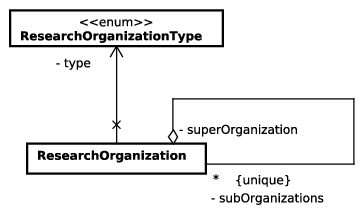

### 3.2 Persons

Persons are involved in a research organization with different possible status (full professor, associate profesor, PhD student...). Each person is associated to different informations (name, gender, email, ORCID number...) that are usually considered for building activity reports for a research unit.

As it is briefly explained in the previous section, a person may be involved in a research organization. The relationship is supported by the concept of *membership*. This membership is for a specific time windows, and for a position (or member status).


### 3.3 Associated Structures

Some times, the activities of the research organizations are in associated to an external structure, or leads to the creation of an extern structure, such as a spin-off company.

**Associated Structures are not managed by the Lab Manager tool.** They are considered as external to the current organizations.

An associated structure has several attributes: acronym, name, short description, date of creation, duration of the creation process, budget that is dedicated to the creation
of the associated structure, a flag that indicates its confidentiality.
An associated structure may be funded by a specific research organization.

The types of associated structures that are recognized by the lab manager are:

* Private company
* Industrial chair with a private company
* Research chair
* Shared international research lab
* Shared EU research lab
* Shared national research lab
* International group of scientific interest
* EU group of scientific interest
* National group of scientific interest
* International research group
* EU research group
* National research group
* Hosted international company in a research organization
* Hosted EU company in a research organization
* Hosted national company in a research organization

Members of research organizations may be implied in the structure. They are the holders of the associated structure.
These holders may hava a specific role in the associated structure:

* Head of the created structure, e.g. CEO.
* Scientific head for a partner.
* Participant of a structure.

Additionally, the person who plays a role in an associated structure have done that for a given research organization and its super organization.
Finally, an associated structure may be linked to a research project (see Research Projects section).

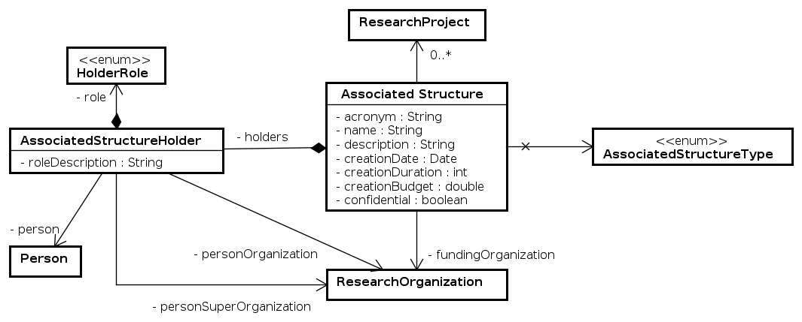

### 3.4 Scientific Axes

A scientific axis represents a transversal research activity inside a organization. They may be associated to members (through the memberships), projects and scientific publications.

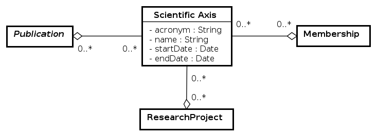


### 3.5 Journals

In academic publishing, a (scientific) journal is a periodical publication intended to further the progress of science, usually by reporting new research. Articles in journals are mostly written by active scientists such as students, researchers and professors instead of professional journalists. There are thousands of scientific journals in publication, and many more have been published at various points in the past. Most journals are highly specialized, although some of the oldest journals such as Nature publish articles and scientific papers across a wide range of scientific fields. Scientific journals contain articles that have been peer reviewed, in an attempt to ensure that articles meet the journal's standards of quality, and scientific validity.

Journal ranking is widely used in the evaluation of an academic journal's impact and quality. Journal rankings are intended to reflect the place of a journal within its field, the relative difficulty of being published in that journal, and the prestige associated with it. They have been introduced as official research evaluation tools in several countries.
Consequently, the project consider different ranking scores for the journals:

* *Impact factor* and CiteScore: reflecting the average number of citations to articles published in journals.
* *SCImago Quartile*: In [Scimago](https://www.scimagojr.com/), each scientific field of the journals is divided into four quartiles: Q1, Q2, Q3 and Q4. Q1 is occupied by the top 25% of journals in the list; Q2 is occupied by journals in the 25 to 50% group; Q3 is occupied by journals in the 50 to 75% group and Q4 is occupied by journals in the 75 to 100% group. This quartile is based on the Scimago Journal Rank (SJR), which is the numeric score associated to the journal.
* *Web-of-Science Quartile* As for Scimago, [Web-of-Science](https://www.webofscience.com/) also ranks the journals in four different quartiles.

Open access (OA) is a set of principles and a range of practices through which research outputs are distributed online, free of access charges or other barriers. Several journals are OA and others are not. This information is stored into the journal entity.

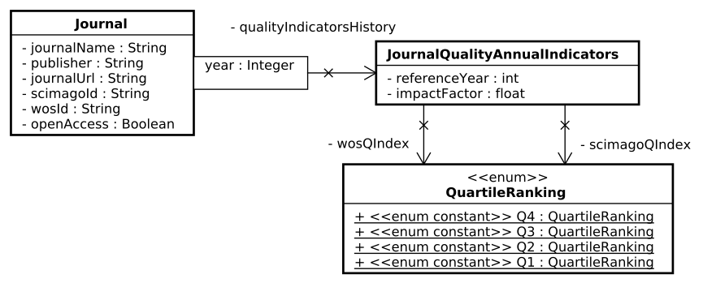

### 3.6 Conferences

A scientific conference is a structured gathering event where researchers share insights and discoveries in their respective fields, foster collaborations, and keep up-to-date with cutting-edge research.
Scientific conferences can have a variety of topics, they tend to be larger in size and wider in scope than symposiums or workshops, which are more focused on a particular subject or issue. They are also different from professional conferences as they are aimed at academia and the scientific community.
The hallmark of a great scientific conference is the quality and relevance of its content, paired with a dynamic, inclusive environment that encourages meaningful connections and exchanges.

Conference rankings are determined by a mix of indicators, including citation rates, paper submission and acceptance rates, and the visibility and research track record of the key people hosting the conference and managing its technical program.

According to the [CORE Ranking Portal](https://www.core.edu.au/conference-portal), conferences may have the following ranks:

* A* - flagship conference, a leading venue in a discipline area
* A - excellent conference, and highly respected in a discipline area
* B - good to very good conference, and well regarded in a discipline area
* C - other ranked conference venues that meet basic standards for peer reviewed venues.

Open access (OA) is a set of principles and a range of practices through which research outputs are distributed online, free of access charges or other barriers. Several conferences are OA and others are not. This information is stored into the conference entity.

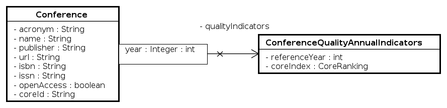

### 3.7 Publications

Academic publishing is the activity of distributing academic research and scholarship to the Research community. Most academic work is published in academic journal articles, conferences, books or theses. Most scientific and scholarly journals, and many academic and scholarly books, though not all, are based on some form of peer review or editorial refereeing to qualify texts for publication. Different types of academic publishing may be condidered, including:

* Academic paper (also called scholarly paper), which is in academic journals or conferences, and contains original research results or reviews existing results or shows a totally new invention;
* Position paper, an essay that represents the author's opinion;
* Thesis or dissertation, a document submitted in support of a candidature for a degree or professional qualification, presenting the author's research and findings;
* Book or book chapters.

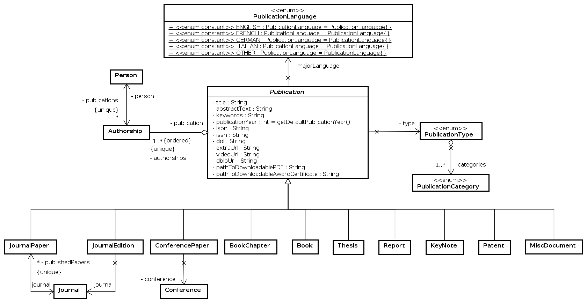

Consquently, a publication (i.e., the result of an academic publishing) is associated to several information, such as its title, abstract text, keywords, DOI number, etc. Each publication is also associated to an ordered list of persons, who are considered as authors (through the `Authorship` type). EAch publication has also a type as defined in the following table.

| Type                | Scopes                            |
| --------------------|-----------------------------------|
| Journal paper       | International or national         |
| Conference paper    | International or national         |
| Oral communication  | International or national         |
| Poster              | International or national         |
| Book                | International or national         |
| Book chapter        | International or national         |
| Journal editing     | International or national         |
| Keynote             | International or national         |
| Thesis              | HDR, PhD, Master                  |
| Patent              | International, european, national |
| Artistic production | Theory of Art                     |
| Reports             | Tech., transfert, documentation   |
| Research tools      | Software...                       |


Each publication type is associated to a category that is defined by the French research agencies (ANR, HCERES, CNU): 

* ACL: Articles in international or national journals with selection commitee and ranked in international databases.
* ACLN: Articles in international or national journals with selection committee and not ranked in international databases.
* ASCL: Articles in international or national journals without selection committee.
* C_ACTI: Papers in the proceedings of an international conference.
* C_ACTN: Papers in the proceedings of a national conference.
* C_COM: Oral Communications without proceeding in international or national conference.
* C_AFF: Posters in international or national conference.
* OS: Scientific books.
* COS: Chapters in scientific books.
* DO: Editor of books or journals.
* C_INV: Keynotes in international or national conference, or seminars.
* TH: HDR, PhD or Master theses.
* PT: Publications for research transfer.
* BRE: Patents.
* OR: Research tools.
* OV: Books for scientific culture dissemination.
* COV: Chapters in a book for scientific culture dissemination.
* PV: Papers for scientific culture dissemination.
* PAT: Artistic research productions.
* AP: Other productions.

### 3.8 Research Projects

A research organization may do research activities in proejct context. A research project is usually funded by a body that is not the research organization that is doing the project.
The

* Acronym of the project
* Title of the project with highlight on scientific contribution
* Logo of the project
* Start date of the project
* Duration of a project in months
* Short description of the project
* A flag that indicates if the project is confidential or not
* A flag that indicates if the project is open source or not
* Global budget for the entire the project, including all the partners
* Project URL
* URLs of videos related to the project
* Specification document associated to the project
* Images that are associated to the project
* Powerpoint associated to the project
* Press publication
* List of ascientific axes in the local organization (see below) that are associated to the project
* Project Status: under preparation, under evaluation by th funding bodies, canceled, rejected by the funding organization, accepted and funded.

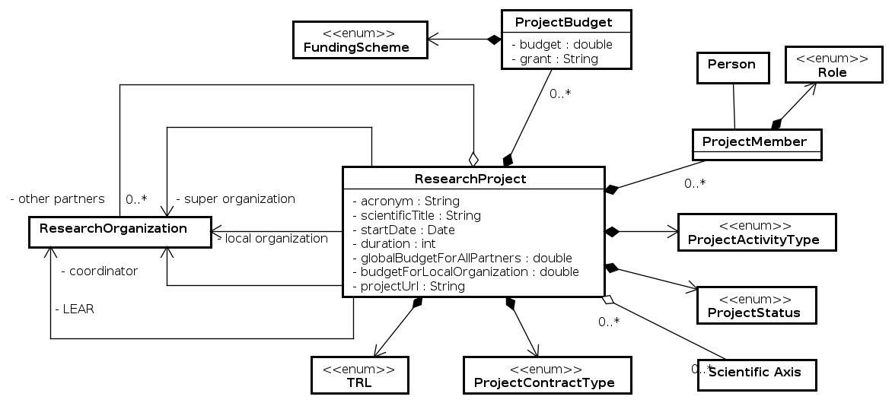

#### 3.8.1 Project Consortium

The different organizations that are participating to a project are members of the project consortium.
All these members are a research organization.
They may have different roles in the consortium:

* **coordinator**: the research organization that is leading and managing the entire project
* **local organization**: the local research organization that is involved in the consortium
* **super organization**: the super organization of the local organization, involved in the project
* **LEAR**: the organization that has the official authority for managing the project's budget for the local organization

Finally, it is possible to specify members of the consortium that are neither the organizer nor the local organization.

#### 3.8.2 Participants from the local organization

Members of the local organization must be implied in a research project, at least a local coordinator.
The roles that may be played by a project participant are:

* Coordinator of the whole project
* Scientific head for a partner
* Leader of a work package
* Leader of a task
* Participant of a project.

#### 3.8.3 Type of Activity

The activities that are undertaken in a project may be of different types:

* **Fundamental research**: activity is fundamental research for acquiring new knowledge
* **Applied research**: activity is applied research for acquiring new knowledge in an application domain
* **Experimental development**: activity is experimental development that applies technical elements for:
  1. the creation of new software product
  2. the creation of new methods, processes, services or systems
  3. the substantial improvement of existing elements.

#### 3.8.4 Technology Readiness Levels (TRL)

The term *Technology Readiness Level* was originally coined by NASA in the aerospace industry to describe and assess the development and maturity of a
technical product. The first use of the TRL term in EU funding programmes was in 2014, when it was introduced in the European Framework Programme
Horizon 2020. TRLs serve as an indicator to better classify the submitted projects. TRLs enable applicants and evaluators to align project proposals
with the expectations of the European Commission by providing a common unit of measurement. The defined TRLs are:

1. Basic principles observed
2. Technology concept formulated
3. Experimental proof of concept
4. Technology validated in lab
5. Technology validated in relevant environment (industrially relevant environment in the case of key enabling technologies)
6. Technology demonstrated in relevant environment (industrially relevant environment in the case of key enabling technologies)
7. System prototype demonstration in operational environment
8. System complete and qualified
9. Actual system proven in operational environment (competitive manufacturing in the case of key enabling technologies; or in space).

#### 3.8.5 Contract Type

A project is supported by a specific contract between the members of the consortium and the finding organization. Different types of contracts are possible
(defined by the French National Research Agency - ANR):

* **RCO**: Collaborative contractual research, e.g., public funding projects, including those with a not academic partner
* **RCD**: Direct contractual research, intellectual property (IP) is shared with the partner
* **PR**: Contractual service, the research organization transfer the IP to the partner
* **PI**: Contract related to the intellectual property.

#### 3.8.5 Budget Details

A project is funding by a public body and/or a private company. Therefore, multiple sources of budget may be associated to a project.
For each budget source, the following information must be provided:

* Funding scheme (see below)
* Budget for the local research organization that is provided by the funding scheme
* Number of the grant agreement.

The accepted funding schemes are:

* Local fundings:
  * A participant himself (self-funding)
  * Local research organization
  * Hosting organization (coordinator usually)
* National fundings:
  * Institut Carnot
  * Regional council of Burgundy Franche Comte
  * Contrat Plan Etat Région (CPER)
  * Fonds uniques interministériels (FUI)
  * ADEME
  * French ANR
  * I-SITE project
  * IDEX project
  * PIA project
  * CIFRE (ANRT)
  * French company
  * French university that is not the local organization
  * Other source of funding from France
* EU fundings:
  * FEDER ("Fonds européen de développement régional")
  * EUREKA project
  * EUROSTAR project
  * European COST action
  * JPI Urban Europe project
  * INTERREG project
  * EDIH project
  * Programme for the Environment and Climate Action (LIFE)
  * H2020 project
  * Horizon Europe
  * European company
  * European university
  * Other source of funding from Europe
* International fundings:
  * International mobility programme from CDEFI, i.e. FITEC, e.g. ARFITEC or BRAFITEC.
  * Campus France
  * Nicolas Baudin Programme for mobiltiy and internships
  * CONACYT
  * Chinease Scholarship Council (CSC)
  * Partenariats Hubert Curien (PHC)
  * International company
  * International university
  * Another source of funding at international level.

### 3.9 Person Supervision

One of the main activity of a research organization is to supervise students (doctoral or master degree).
It means that a student will do a specific research work (described by a title) under the supervision of researchers.
The supervisors is applied in a portion of the supervision task (described by a percentage) and have specific role: director, supervisor, member of the annual evaluation committee.
The research works by the student may be partly undertaken in another university (joint position) or in the context of a company creation (entrepreneur).
By national regulation, a supervised student is funded (funding scheme and details).
At the end of the work, the student usually does a oral defense at a specified date.
The supervision entity enables to keep track of the activities of the student after the supervision period: description of the position of the supervised person after the supervision
period, and the number of ATER positions given to the supervised person.

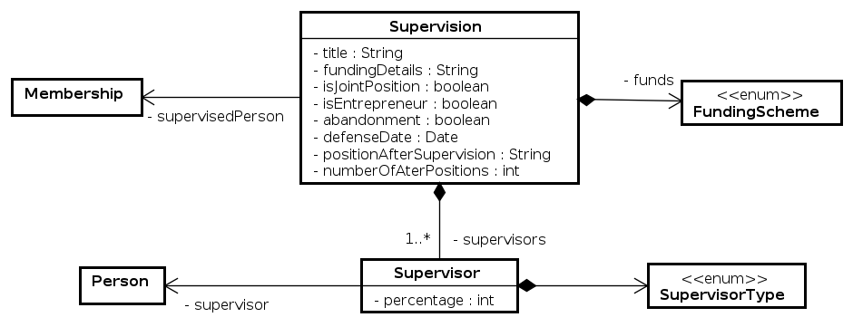

### 3.10 Jury Memberships

In the activities of researchers, they are involved in jurys of doctoral or master degrees in order to deliver these degrees to students.
These jury memberships do not concern the directly supervised persons, who are managed by the entity described in the previous section.
The jury emberships that are stored in the lab manager tool concerns only for whose outside any research organization.

A jury membership is for a candidate person for one of the degrees:
HDR, PhD, Master, Bachelor. The work of the candidate has a title and was done in a specified university (with its country).
The membership may also provides the list of the promotoers of the candidates.

A jury membership concerns a person from a registered research organization. This person may has one of the following roles:
president of the jury, reviewer, examiner, or invited person.

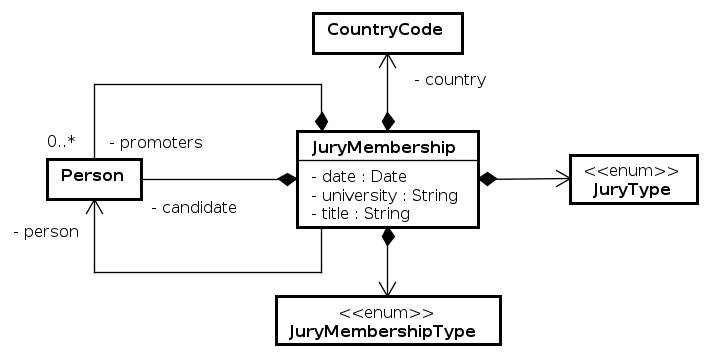
	
### 3.11 Person Invitations

During there activities, the members of the research organizations may invite an external researcher (incoming invitation), or being invited
inside another research organization (outgoing invitation) for a long stay (usually at last one week). The lab manager tool enables to store both types of invitation.

An invitation concerns a guest person (the invited person) and the inviting person (inviter) during a specific time period.
The university may be the one of the guest or the inviter, depending if it is a incoming invitation (guest's university) or
outgoing invitation (inviter's university).

In order to specify the type of the invitation, the following choices are possible:

* Incoming guest professor
* Incoming guest PhD student
* Outgoing guest.

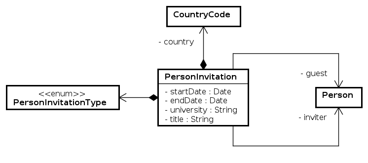

### 3.12 Teaching Activities

The teaching activities of the members of the research organization could be saved in the lab manager.
Eech teaching activity is defined by the following attributes:

* Code of the teaching unit, if any
* Title of the teaching unit
* Explanation on the content of the teaching activity that may appear in the resume of the teacher
* The language in which the unit is provided to the students
* Level of the teaching unit of the teaching unit: doctoral level, master level, bachelor level (Licence in French), or level of high schools (lycées in French)
* Type of students in the teaching unit: students are in their initial training, students are in apprenticeship, or students are doing there teaching activities during their professional career
* Name of the degree in which this teaching unit is included
* The university or organization that is delivering the degree
* Role of the person in the teaching unit: creator of the activity, supervisor in the activity, or participant to the activity
* The average number of students per year
* The date and end dates of the teaching activity
* A flag that indicates if the person has different factors for computing hETD from tutorial and practice work hours
* URL of a website related to the teaching unit
* URL of a website related to the source code related to the teaching unit
* A copy of the slides in PDF format
* The number of hours per type of activity, where this type is one of:
  * Lectures (or Cours Magistral in French)
  * Integrated courses (or Cours Intégrés in French)
  * Turotials (or Travaux dirigés in French)
  * Practical works (or Travaux pratiques in French)
  * Supervision of student groups
  * Supervision of student projects.
* Types of pedagogical activities that are carried in the teaching activities. They may be inside:
  * Practices are based on the historical method with lectures, tutorials and lab works
  * Pedagogy 3.0
  * Inverted classroom
  * Reverse class
  * Collaborative works
  * Distance learning
  * Social network learning
  * Modern presentation tools
  * Virtual classroom
  * Project-oriented unit
  * Problem-based learning
  * Serious game
  * Other method.

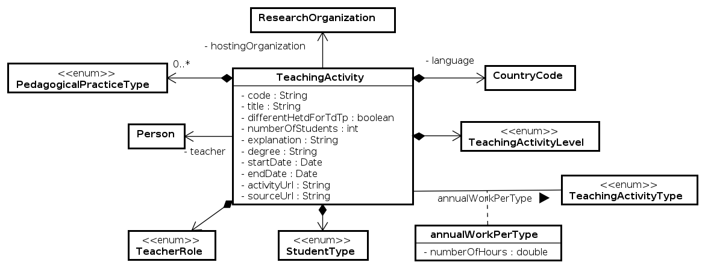

## 4. Installation Notes

This section provides some inputs for the installation of this software on a real-life server.

After installing the WAR on the server, and configuring the SQL server, it is important to enable Tomcat to write into the uploadable files.

Let the server path to the upload folder be `/var/www/mysite/Downloadables/` (this folder name is defined in the `application.yml` file).
You must configure Tomcat9 for enabling the writing in this folder. In order to do so, and because Tomcat9 is sandboxed by systemd on Ubuntu operating system, you have to edit the file `/etc/systemd/system/multi-user.target.wants/tomcat9.service'.

In this file, you have to add:
```
[Service]
ReadWritePaths=/var/www/mysite/Downloadables/
```

Then, it is necessary to restart the services:
```
systemctl daemon-reload
systemctl restart tomcat9
```

## 5. Software License

```
Copyright (c) 2019-2024, CIAD Laboratory, Universite de Technologie de Belfort Montbeliard

This program is free software: you can redistribute it and/or modify
it under the terms of the GNU Affero General Public License as published
by the Free Software Foundation, either version 3 of the License, or
(at your option) any later version.

This program is distributed in the hope that it will be useful,
but WITHOUT ANY WARRANTY; without even the implied warranty of
MERCHANTABILITY or FITNESS FOR A PARTICULAR PURPOSE.  See the
GNU Affero General Public License for more details.

You should have received a copy of the GNU Affero General Public License
along with this program.  If not, see <https://www.gnu.org/licenses/>.
```

