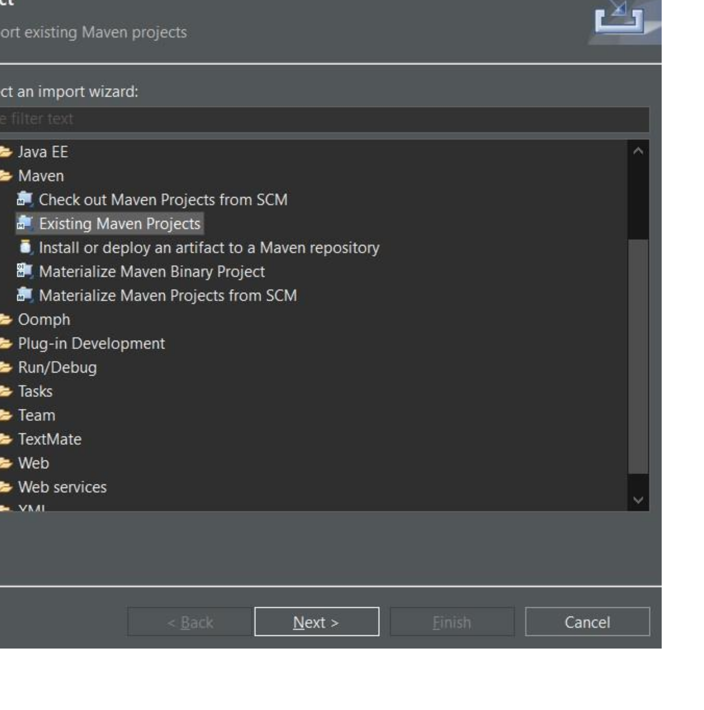

# Research Laboratory Online Management Tools

This project is the backend implementation of the online tools for managing the database of a research laboratory.

## 1. Installation for developers

### 1.1. Base tools

The following tools must be installed for contributing to the project, and testing these contributions:

* **Java:** the project is implemented with Java 11. You must downlad and install [Java Development Kit (JDK) 11](https://www.oracle.com/fr/java/technologies/javase/jdk11-archive-downloads.html).
* **Maven:** Maven is the compilation framework that is used for the project. You must [download and install Maven](https://maven.apache.org/download.cgi) (at least the version 3.8.4) in order to have it available from the command-line interface.
* **Git:** It is recommended to install a Git tool that could be used outside the development environment, e.g. the command-line interface or windows tools.
* **Eclipse:** You must install a specific version of Eclipse: [Eclipse IDE for Enterprise Java and Web Developers](https://www.eclipse.org/downloads/)
* **Database:** *For developers,* you don't need to install a database system. The project is configured for using the Apache Derby Database system that is local file-based. *For production,* the project is configured for using MySQL. Therefore, you must [download and install MySQL](https://dev.mysql.com/downloads/installer/).

### 1.2. First creation of the project

* **Fork the project:** The source code of the project is stored on a Git repository hosted by [Bitbucket](https://bitbucket.org/ciadlabfr/labmanager-server-spring/) as the *Master server*. However, you will not have access rights to push up your commits during the development stage. Therefore, it is recommended to create a *fork* of the Master server on Bitbucket. For the rest of this document, the URL of your fork repository is assumed to be `https://bitbucket.org/myself/labmanager-server-spring`.
* **Clone of the source code:** You should clone your Git repository on your local computer to let you work locally on the source code:
```
$> git clone https://bitbucket.org/myself/labmanager-server-spring
```
The folder in which the source code is copied is assumed to be named `/path/to/src` (using Unix standard).
* **First compilation on CLI:** In order to be sure that all the libraries are downloaded and installed on your computer, it is recommended to launch a maven compilation from the command-line interface:
```
$> cd /path/to/src
$> mvn clean install
```
The compilation must be successful.

* **Import the source code in Eclipse:** For creating the project in the Eclipse IDE, you have to follow the steps:
  * Launch the Eclipse IDE
  * Open the import wizard with `Menu > File > Import`
  * Select the importer `Maven > Existing Maven Projects` 
  * On the next page of the wizard, you must select the root source folder that contains a `pom.xml` file, i.e., `/path/to/src/labmanager-2`
  * Click on the `Finish` button to create the project
* **Change of the development configuration:** During the development stage, you will have to use a specific Spring configuration. This configuration is stored into the file `src/main/resources/application-dev.yml` as a YAML configuration file associated to the profile "dev". You must edit this file with your local information as described below. *Do not forget to not save these changes on the Git repository`.
  * *Change the Derby database configuration:* The content of the configuration file has:
```
# Derby database
driver-class-name: org.apache.derby.jdbc.EmbeddedDriver
url: jdbc:derby:/tmp/ciadlab/db;create=true
```
    Replace `/tmp/ciadlab/db` by the folder name in which you wold like to save your database
  * *Change the logging configuration:* The content of the configuration file has:
```
# Path to the log file
external-file: /tmp/tomcat9/CIADSpringRestHibernate.log
```
    Replace `/tmp/tomcat9/CIADSpringRestHibernate.log` by the filename of the file that must contain the logs.

### 1.3. Create JUnit5 tests 

The guideline of the Master development team recommend to create JUnit5 tests for all the significant contributions. You must create your tests into the source folder `src/test/java` and copy additionnal testing resources into the source folder `src/test/resources`.

For launching the tests, you could create and use a specific launch configuration of type `JUnit`:

* Open the menu `Run > Run configurations`
* Select the type `JUnit` and click on the `Create new launch configuration` button at the top of the list
* Enter the name of the launch configuration on the right part of the wizard windows, e.g. with `All tests`
* Select `Run all tests in the selected project, package or source folder`
* Select the `labmanager` project below
* Ensure that the test runner is `JUnit 5`
* Click on the `Run` button for saving the launch configuration and launching the tests

### 1.4. Launching of the project

For launching the backend services into a local Tomcat server, you could launch it into the Eclipse environment. To do so, you have to create a configuration for Spring Boot App:

* Open the menu `Run > Run configurations`
* Select the type `Spring Boot App` and click on the `Create new launch configuration` button at the top of the list
* Enter the name of the launch configuration on the right part of the wizard windows, e.g. with `labmanager`
* Select the project `labmanager`
* Select the `labmanager-2` project below
* Enter the main type: `fr.ciadlab.labmanager.LabManagerApplication`
* Enter the profile: `dev`
* Click on the `Run` button for saving the launch configuration and launching the Spring Boot application

### 1.5. Import of data

Not yet available.

### 1.6. Merge your contributions to the Master server

As soon as all your contributions are comitted on your fork Git repository, it is possible to provide your changes to the Master development team through a *Pull Request* (PR) on Bitbucket:

* Open the Master Git Repository on [Bitbucket](https://bitbucket.org/ciadlabfr/labmanager-server-spring/)
* Open the PR page
* Create a new PR
* Select your fork Git repository as the source of the PR
* Fill-up the PR form

## 2. Software License

```
Copyright (c) 2019-22, CIAD Laboratory, Universite de Technologie de Belfort Montbeliard
All rights reserved.

This software is the confidential and proprietary information
of the Systems and Transportation Laboratory ("Confidential Information").
You shall not disclose such Confidential Information and shall use
it only in accordance with the terms of the license agreement
you entered into with the CIAD.

http://www.ciad-lab.fr/
```

