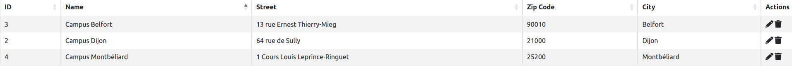
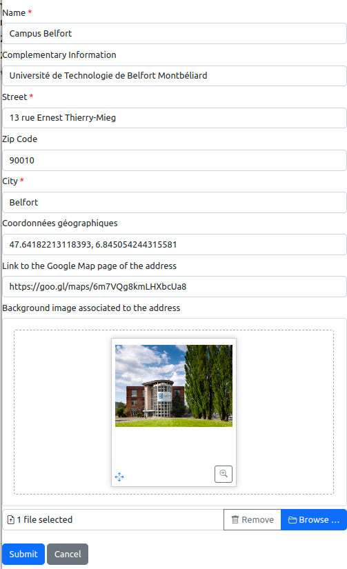

# List of geographical addresses

## 1. Introduction

The information system of the lab contains research organizations. These research organization may have geographical or postal addresses. The management of these addresses is accessible from the general administration page:

As it is illustrated on the figure above, three features are provided:

* `List of addresses`: display the list of all the addresses independently of the research organizations.
* `Add an address`: add an address in the information system.
* `Public addresses`: show the addresses that may be displayed in a front website, as illustrated by the following figure.

## 2. List of addresses

The entire list of the addresses is displayed in a table:

The columns of the table are the following:

* `ID`: the identifier of the address inside the lab's information system.
* `Name`: the name of the address that is used for selecting the address in the web forms.
* `Street`: the name of street.
* `Zip code`: the ZIP code for the address.
* `City`: the name of the city.
* `Actions`: list of tools to be applied on an address:
  * editing the address information (see Section 3),
  * deletion of the journal.

## 3. Add or edit an address

The backend software provides a form for editing or adding an address in the information system. This form contains the mandatory informations (marked with a red star) and the optional informations to be associated to an address:

* `Name`: it is the name of the address that is used for selecting the address in the web forms.
* `Complementary information`: any additional information that is associated to the address. It is usually the name of the institution such as the university.
* `Street`: the name of street.
* `Zip code`: the ZIP code for the address.
* `City`: the name of the city.
* `Geographical coordinates`: the GPS coordinates of the address. It is usually two floating point numbers separated by a comma character.
* `Link to the Google Map page of the address`: the URL of the page on Google Map that shows the address.
* `Background image associated to the address`: a picture that may be used in the front-end page for showing the address.

