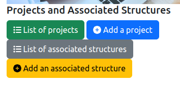
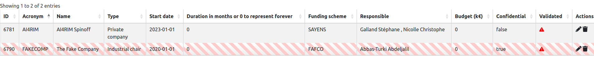
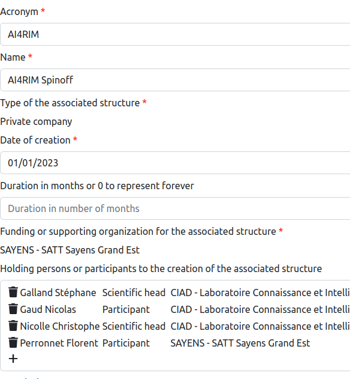
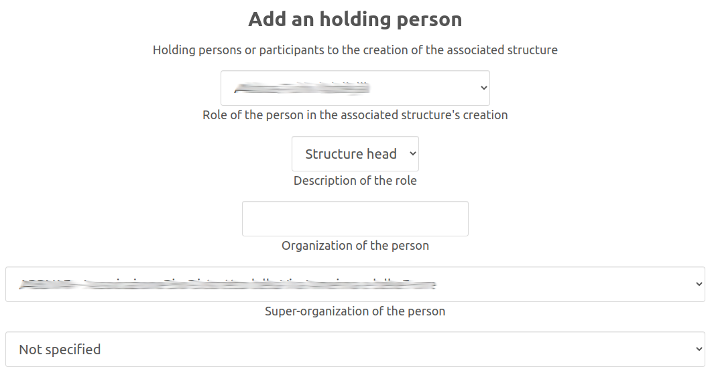
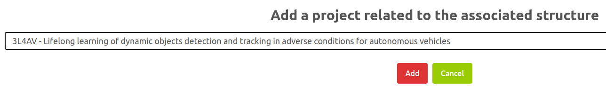

# List of known associated structures

## 1. Introduction

A research lab may ba associated to external structures that are basically created by one or more members of the lab.
The types of associated structures are:

* A private company, start-up or spin-off;
* A research chair;
* An industrial chair;
* An international or national research lab shared with another institution;
* An international or national group of scientific interest.

The management of the associated structure' list is accessible from the general administration page:

As it is illustrated on the figure above, two features are provided:

* `List of associated structures`: display the list of all the associated structures and the tools for updating them.
* `Add an associated structure`: add a structure that is not yet inside the information system.

There two features are described in the following sections.

## 2. List of associated structures

The entire list of the associated structures is displayed in a table:

The columns of the table are the following:

* `ID`: the identifier of the associated structure inside the lab's information system.
* `Acronym`: the acronym of the associated structure.
* `Name`: the name of the associated structure.
* `Type`: the type of associated structure, e.g., private company.
* `Start date`: the start date of the process for the creation of the associated structure, with the `YYYY-MM-DD` format.
* `Duration in months`: indicates the duration of the structure's creation in months of the project. If the value `0` is provided as the duration, the structure's creation is assumed to be immediate.
* `Funding scheme`: the organization that is funding the creation of the associated structure.
* `Responsible`: the list of the person in the current research organization who are leading the structure's creation.
* `Budget`: the budget of the structure's creation itself. The value is expressed in kilo-euros.
* `Confidential`: indicates if the associated structure is marked as confidential. A confidential structure is never displayed on the public pages. Only administration pages provide information on confidential structures.
* `Validated`: indicates if the information of the associated structure is validated by an authority of the lab (Director for example).
* `Actions`: list of tools to be applied on a project:
  * editing the structure information (see Section 3),
  * deletion of the structure.

## 3. Adding or editing an associated structure

### 3.1 General Form

The backend software provides a form for editing or adding a associated structure in the information system. This form contains the mandatory informations (marked with a red star) and the optional informations to be associated to a structure:

* `Acronym`: it is the acronym of the associated structure. Usually, it is a short word.
* `Name`: the name of the associated structure.
* `Type of the associated structure`: describes the type of structure. It may be one of: `Private company`, `Industrial chair`, `Research chair`, `International Research Lab`, `International Group of Scientific Interest`, `National Research Lab`, `National Group of Scientific Interest`.
* `Date of creation`: it is the date of start of the associated structure's creation. This date is used as a reference in many official documents.
* `Duration in months`: indicates the duration in months of the structure's creation. If the value `0` is provided, the structure creation is assumed to have instantaneous.
* `Funding or supporting organization for the associated structure`: the organization that is funding the sturcture's creation.
* `Holding persons or participants to the creation of the associated structure`: the list of persons that are involved in te structure's creation (see Section 3.2).
* `Description`: it is the short description or summary of the associated structure that will be displayed on the public pages related to the structure.
* `Budget for creating the associated structure`: it is the budget provided by the funding scheme for the creation of the associated structure. It must be expressed in kilo-euros.
* `List of projects that are related to the creation of this associated structure`: it provides the list of projects that are related to the creation of the associated structure (see Section 3.3).
* `Is the projet confidential?`: indicates if the structure is marked as *CONFIDENTIAL*. A confidential structure is never displayed on public pages.
* `Is the project validated by a local authority?`: this check box indicates if the Director of the lab has validated the information of the associated structure.

### 3.2 Adding holding persons to the associated structure

An associated structure could be created with the support of lab's members. It is possible to specify the different persons and their respective roles in the structure's creation.
Each time you would add an holding person, the following dialog box is shown on the screen:

On this dialog box, you must enter the following information related to an holding person:

* The person who is involed in the structure's creation.
* The role of the person in the structure's creation, and a brief but detailled description of the role played by the person.
* Grant information: you may provides the grant agreement or contract's number here.
* The research organization in which the person is involved.
* THe super organization that is supporting the associated structure.

After clicking on the `Add` button, the above information is added to the project.

### 3.3 Adding reference to a project in the associated structure

The creation of an associated structure may be the consequence of or the next step after a research project.
Therefore, it is possible to link an associated structure to projects. You could do that by selecting the project in the provided list as illustrated by the following figure.

