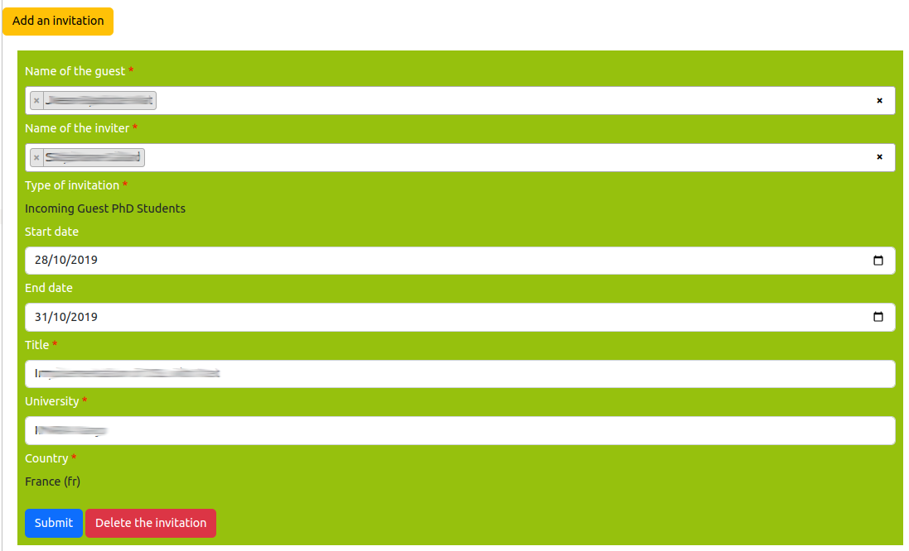

# Edit the incoming and outgoind invitations

> **_3 steps_**

## Step 1. Open the editor

For editing your invitations, open your page on the website. If you are connected and you have included the invitations on the page (see [editing of the member page](editmemberpage.md)), editing tools are provided as illustrated on the figure below: `Change invitations` for updating the list of your incoming and outgoing invitations, and the "pen" icon on the side of an invitation for editing it.

## Step 2. Edit an existing invitation

The editor of the invitations is a special page that shows all the invitations for a person.

Each invitation for a person X is displayed is a separated box that is green for existing invitations in the information system, and magenta for a new invitation.

This box contains a fields that are describing the invitations as follow:

* `Name of the guest`: The name of the guest. It is a person outside your organization for incoming invitation. Or, it is your name if it is an outgoing invitations.
* `Name of the inviter`: The name of the person whi is inviting. It is a person outside your organization for incoming invitation. Or, it is your name if it is an outgoing invitations.
* `Type of the invitation`: is the type of invitation that could be: `incoming Guest PhD Professors`.
* `Start date`: is the date of starting for the supervision.
* `End date`: is the final date of the associated project.
* `Title`: it is the title of the works that are conidered for the invitation.
* `University`: is the name of the university which is hosting the candidate.
* `Country`: is the country of the university which is hosting the candidate.

Click on the `Submit` button for saving your changes.

## Step 3. Adding a missed jury membership

If a jury membership is missed, click on the button `Change invitations`:

In the addition page, you have to click on the button `Add invitation` and fill up the form according to the guidelines that are described in Step 2. 

