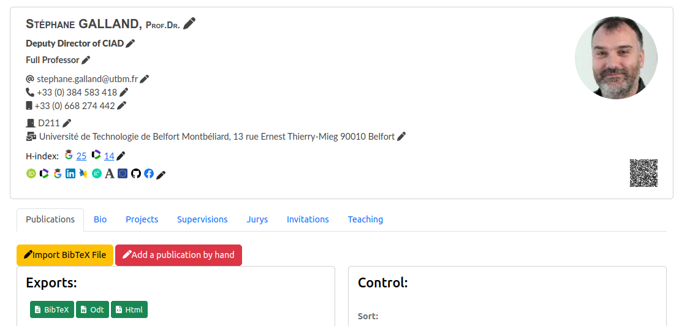
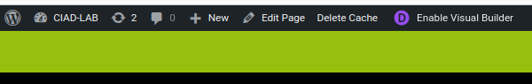
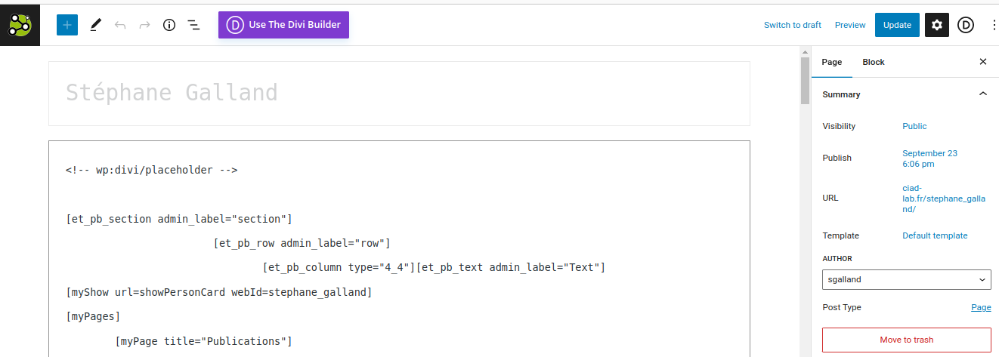
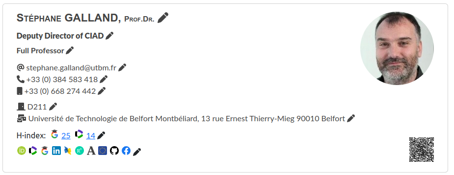
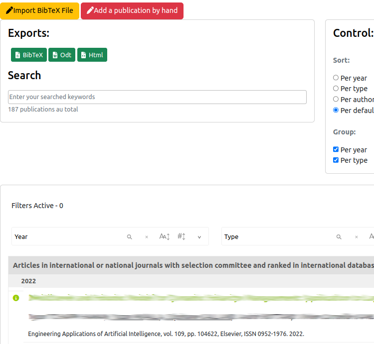
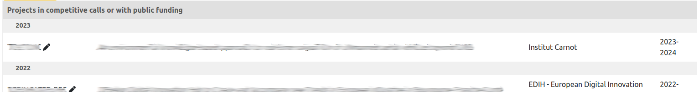
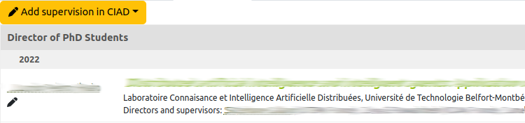
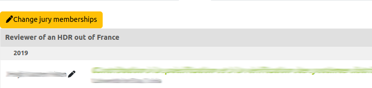
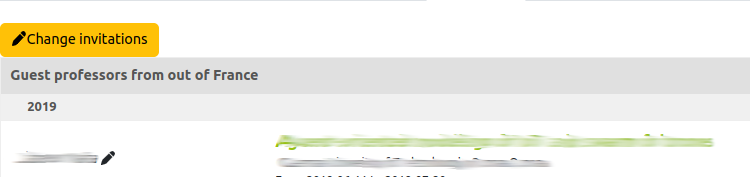

# Edit the member page

> **_4 steps_**

## Step 1. Open the member page

Each active member of the research organization should have a member page on the website of the organization (if not, please contact the organization's mamanger).

For opening your member page, you have to:

1. Click on the `Team` (or `Equipe`) link in the top menu bar of the laboratory

2. Click on your name in the list
3. You member page should look like:

The member page contains components that are automatically built by the server from the information system: the top description of your profile, the list of publications, the list of supervisions, etc.

Soe other part are not automatically generated and must be edited by you maunally. Since the front-end website is based on the famous WordPress (WP) content management system (CMS), you will have to use the tools of this CMS.

## Step 2. Open the WP CMS page editor

The WordPress page editor is accessible only if you are [connected](login.md). The editor link should appear inside the top-most tool bar on the page, e.g. `Edit Page` or `Enable Visual Builder`.

After clicking on the `Edit Page` link, you should see the WP CMS page editor:

The main page of the page shows to you:

* the title of the page (usually, the value is your full name).
* an editing component for changing the content of the page.

> **_Note:_** The content of the page is based on a text in which you could write specific WP instructions. These instructions are specified between bracket characters, e.g. `[myPages]`.

The research organization server provides specific instructions for including the components that are generated by the organization's server. They are described in the following steps.

## Step 3. Adding instructions that are specific to the research organization server

### a) Instructions for creating tabs

Tab components were selected as the default way for structuring the page's content in different sections that are easy to find and display:

For creating the tabs, you have to use two specific instructions:

* `[myPages] ... [/myPages]`: specify where you would like to include the tabs in the page. The text between the opening and closing instructions is built with a sequence of instructions, below.
* `[myPage title="The Title"] ... [/myPage]` enables you to create a tab with a specific title (e.g., `The Title`).The text between the opening and closing instructions is the content of the tab.

For example, for obtaining the tabs in the figure above, the following text is typed:

	[myPages]
		[myPage title="Publications"] ... [/myPage]
		[myPage title="Bio"] ... [/myPage]
		[myPage title="Projects"] ... [/myPage]
		[myPage title="Supervisions"] ... [/myPage]
		[myPage title="Jurys"] ... [/myPage]
		[myPage title="Invitations"] ... [/myPage]
		[myPage title="Teaching"] ... [/myPage]
	[/myPages]

> **_Note:_** The names of the instructions is case-sensitive.

### b) Instructions for showing your profile description

Most of the member page include a member's description summary that looks like:

To show up this description, you have to use the instruction below:

	[myShow url=showPersonCard webId=<ID>]

Where `<ID>` should be the identifier of your member page, e.g. `stephane_galland` if the member page URL is `https://www.ciad-lab.fr/stephane_galland`.

### c) Instructions for showing your publications

Most of the member page include a list of publications for the member that looks like:

To show up this publication list for you, you have to use the instruction below:

	[myShow url=showPublications webId=<ID>]

Where `<ID>` should be the identifier of your member page, e.g. `stephane_galland` if the member page URL is `https://www.ciad-lab.fr/stephane_galland`.

### d) Instructions for showing your academic and non-academic projects

Some of the member pages include a list of the academic and non-academic projects of the member that looks like:

To show up this project list for you, you have to use the instruction below:

	[myShow url=showProjects webId=<ID>]

Where `<ID>` should be the identifier of your member page, e.g. `stephane_galland` if the member page URL is `https://www.ciad-lab.fr/stephane_galland`.

### e) Instructions for showing your supervisions

Some of the member pages include a list of supervisions for the member that looks like:

To show up this supervision list for you, you have to use the instruction below:

	[myShow url=showSupervisions webId=<ID>]

Where `<ID>` should be the identifier of your member page, e.g. `stephane_galland` if the member page URL is `https://www.ciad-lab.fr/stephane_galland`.

### f) Instructions for showing your jury memberships

Some of the member pages include a list of jury memberships for the member that looks like:

To show up this jury membership list for you, you have to use the instruction below:

	[myShow url=showJuryMemberships webId=<ID>]

Where `<ID>` should be the identifier of your member page, e.g. `stephane_galland` if the member page URL is `https://www.ciad-lab.fr/stephane_galland`.

### g) Instructions for showing your incoming and outgoing invitations

Some of the member pages include a list of incoming and outgoing invitations for the member that looks like:

To show up this invitation list for you, you have to use the instruction below:

	[myShow url=showInvitations webId=<ID>]

Where `<ID>` should be the identifier of your member page, e.g. `stephane_galland` if the member page URL is `https://www.ciad-lab.fr/stephane_galland`.

### g) Instructions for showing your teaching activities

Some of the member pages include a list of teaching activities for the member that looks like:

To show up this activity list for you, you have to use the instruction below:

	[myShow url=showTeaching webId=<ID>]

Where `<ID>` should be the identifier of your member page, e.g. `stephane_galland` if the member page URL is `https://www.ciad-lab.fr/stephane_galland`.

## Step 4. Editing the information

All the components that are described above are able to show a small "pen" icon that will enable you to edit and change the displayed information.

For showing the "pen" icons, you must be [connected](login.md).

Specific documentation are provided for helping you to edit data that is shown:

* [Edit the personal informations](editpersonalinfo.md)
* [Edit the organization memberships](editorgamemberships.md)
* [Edit the publications, seminars, keynotes, etc.](editpublications.md)
* [Import publications from BibTeX](importbibtex.md)
* [Edit your academic and non-acedemic projects](editprojects.md)
* [Edit the supervisions](editsupervisions.md)
* [Edit the jury memberships](editjurymemberships.md)
* [Edit the incoming and outgoing invitations](editinvitations.md)
* [Edit the teaching activities](editteachingactivities.md)

