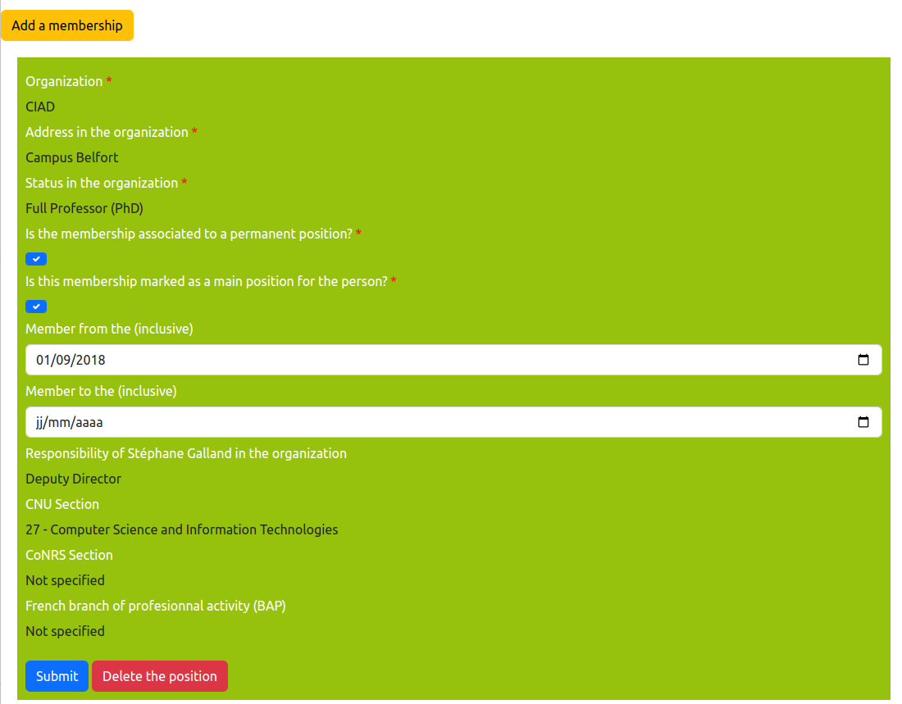
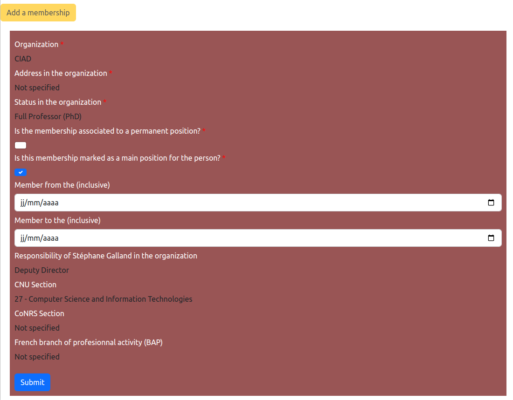

# Edit organization memberships

> **_3 steps_**

## Step 1. Open the editor

For editing your personal informations, open your page on the website. If you are connected, your personal card should look like the figure below. Please note the "pen" icons.

For editing your organization memberships, click on the pen on the side of your position, one the third line. Several of the other pen icons are also linked to the organization membership editor.

## Step 2. Edit your memberships

The backend software provides a form for editing or adding an organization membership in the information system.

Each membership is display in a box that has a gray background if the membership if finished, green if it is active, and magenta for new or future membership.

Each membership box contains the fields to be filled up for describing a membership:

* `Organization`: it is a combo box in which you could select the organization that corresponds to the membership.
* `Address in the organization`: it is a combo box in which you could select the address of the organization that corresponds to the membership.
* `Status un the organization`: it is a combo box in which you could select the type of position that you are owning with this membership.
* `Is the membership associated to a permanent position?`: Indicates if the membership corresponds to a permanent position (fonctionnaire, etc.).
* `Is the membership marked as a main position for the person?`: Indicates if the membership is a "main" membership. The "main" memberships are used for building the personal card that is illustrated by the first figure on this page.
* `Member from the (inclusive)`: indicates the starting date of the membership.
* `Member to the (inclusive)`: indicates the ending date of the membership.
* `Responsibility of X in the organization`: indicates if you have obtained a specific responsibility in the organization during the membership's period.
* `CNU Section`: For researchers in university, it is the speciality number that is defined by the French University National Council.
* `CoRNS Section`: For researchers in research institution, it is the speciality number that is defined by the French National Research Council.
* `French branch of perfesionnal activity (BAP)`: For engineers and staff members, it is the speciality name that is defined by the French Ministry.

When you have finished to edit the form, click on the `Submit` button. By clicking on the `Delete the position` button, you could delete the membership.

If you need to create a new position, move to Step 3.

## Step 3. Add a new membership

For adding a membership, click on the `Add a membership` button. The input form will be displayed as illustrated below, and the form could be filled up in the same way as those explained in Step 2.

