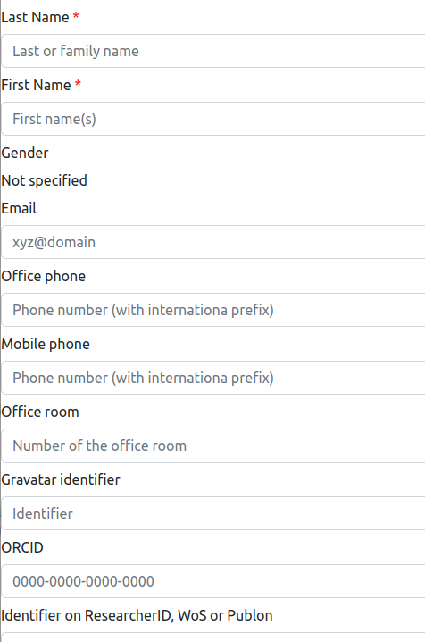

# Edit personal information

> **_3 steps_**

## Step 1. Open the editor

For editing your personal informations, open your page on the website. If you are connected, your personal card should look like the figure below. Please note the "pen" icons.

For editing your personal informations, click on the pen on the side of your name, one the first line. several of the other pen icons are also linked to the personal information editor.

## Step 2. Edit your personal informations

The backend software provides a form for editing or adding a person description in the information system. This form contains the mandatory informations (marked with a red star) and the optional informations to be associated to a person. The following figure shows you a part of the form.

* `Last Name`: the last name of the person.
* `First Name`: the last name of the person.
* `Gender`: the gender of the person.
* `Email`: the email of the person.
* `Office phone`: the office phone number of the person, using the international notation with the country prefix.
* `Mobile phone`: the mobile phone number of the person, using the international notation with the country prefix.
* `Office room`: the number of the office room of the person.
* `Gravatar identifier`: the identifier of the person on [Gravatar](http://gravatar.com). Gravatar is a online platform for stored and shared photo of a person. It is one of the sources for the information system to get the person's photo.
* `ORCID`: the identifier of the person on [ORCID](http://orcid.org), which is one of the standard platform for identifying a researcher worldwide.
* `Identifier on ResearchID, WoS or Publon`: the identifier of the person on [Web-of-Science](http://webofscience.com) (and the related ResearcherID and Publon platforms), which is one of the standard platform for identifying a researcher worldwide.
* `Identifier on Scopus`: the identifier of the person on [Scopus by elsevier](https://www.scopus.com), which is one of the standard platform for obtaining stats on the person's scientific publications and the related indicators.
* `Identifier on Google Scholar`: the identifier of the person on [Google Scholar](https://scholar.google.com), which is one of the standard platform for obtaining stats on the person's scientific publications and the related indicators. It is also used for obtaining the photo of the person.
* `Identifier on Github`: the identifier of the person on [Github](https://github.com), which is one of the standard code sharing platform worldwide. It is also used for obtaining the photo of the person.
* `Identifier on Research Gate`: the identifier of the person on [Research Gate](https://researchgate.com), which is one of the pro social networks for researchers.
* `Identifier on Facebook`: the identifier of the person on Facebook.
* `Internet address of the DBLP page`: the URL of the person on [DBLP](https://dblp.uni-trier.de/), which is a platform for sharing your publications (mostly in Computer Science).
* `Internet address of the Academia.edu`: the URL of the person on [Academia](https://academia.edu/), which is a social network for sharing your publications.
* `Internet address of the EU CORDIS page`: the URL of the person on CORDIS, the web-site of the European Comission.
* `Naming convention for the person's page on the institution website`: it indicates how the URL of the person's page on the organization website is built. It may be:
  * `First and last names`: the URL is `https://hostname/fistname_lastname`.
  * `Email without domain part`: the URL is `https://hostname/someid` if the person has the email `someid@domain`.
  * `author-`: the URL is `https://hostname/author-<ID>` where the `<ID>` is replaced by the database ID of the person.
* `Hindex on Google Scholar`: the H-index of the person that is provided by [Google Scholar](https://scholar.google.com).
* `Hindex on Web-of-Science (WoS)`: the H-index of the person that is provided by [Web-of-Science](http://webofscience.com).
* `Hindex on Scopus`: the H-index of the person that is provided by [Scopus by Elsevier](https://www.scopus.com).
* `Number of paper citations on Google Scholar`: the number of paper citations for the person that is provided by [Google Scholar](https://scholar.google.com).
* `Number of paper citations on Web-of-Science (WoS)`: the number of paper citations for the person that is provided by [Web-of-Science](http://webofscience.com).
* `Number of paper citations on Scopus`: the number of paper citations for the person that is provided by [Scopus (Elsevier)](https://www.scopus.com).

## Step 3. Save the changes

Click on the `Submit` button for saving your changes.

