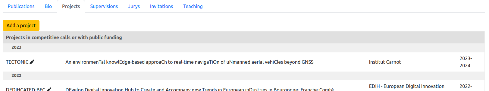
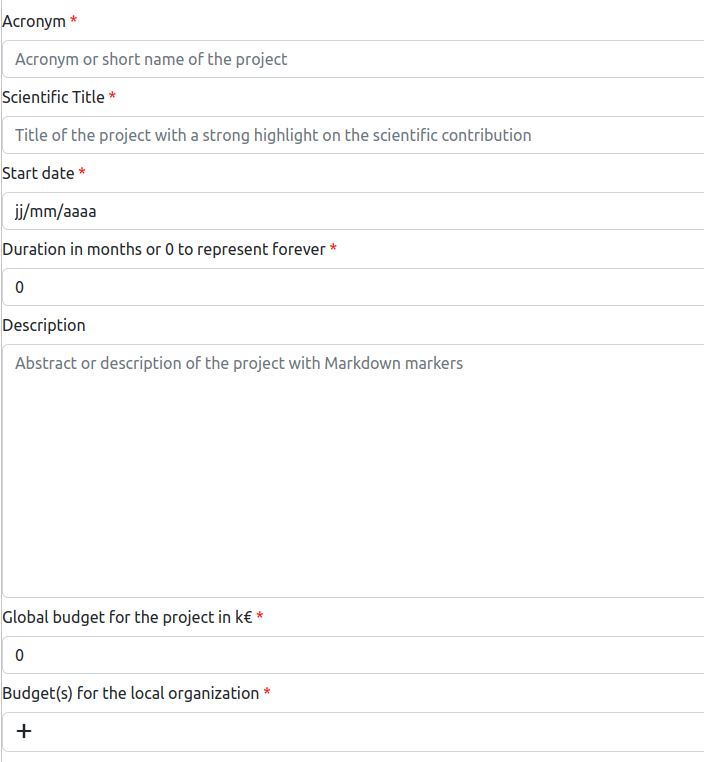

# Edit the academic and non-academic projects of a person

> **_2 steps_**

## Step 1. Open the editor

For editing your academic and non-academic projects, open your page on the website. If you are connected and you have included the projects on the page (see [editing of the member page](editmemberpage.md)), editing tools are provided as illustrated on the figure below: `Add project` for adding a project, and the "pen" icon on the side of an existing project.

## Step 2. Edit an existing project

The editor of the project is a special page that is illustrated below:

For details on the edition form, see the [dedicated page](projects.md).

