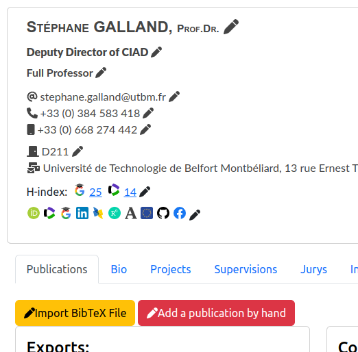
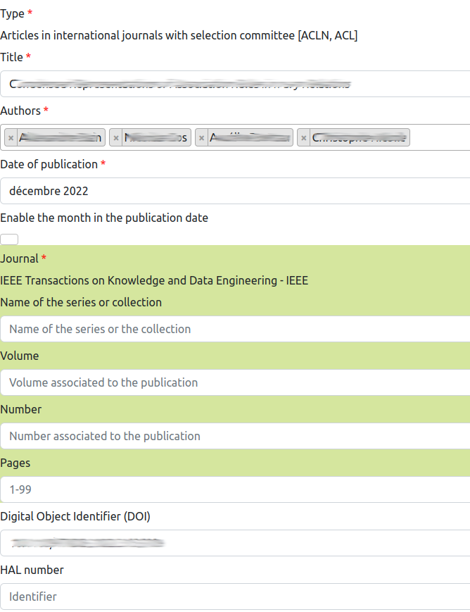
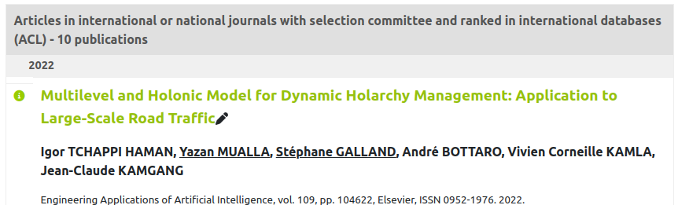

# Edit publications

> **_3 steps_**

## Step 1. Adding a publication by hand

For adding a publication by hand, open your web page (assuming that you have a list of your publications on this page). If you are connected, the button `Add a publication by hand` is provided:

After clicking on this button, a form is shown for adding a publication description in the information system. This form contains the mandatory informations (marked with a red star) and the optional informations to be associated to a publication. The following figure shows you a part of the form.

### Common fields for the publications

The fields that are common to all the types of publications are:

* `Type`: the type of the publication (see Section 2). When you change this field value, the **input fields are automatically adapted** to ask you the right information for the type of publication.
* `Title`: the title of the publication.
* `Authors`: the list of the authors of the publication. You have to type the name of a person, and press `<ENTER>` to add the person in the list. The component opens a popup window with the already known persons.
* `Date of publication`: indicate the month and year of publication. The month value is considered only if the checkbox `Enable the month in the publication date` is checked. If you don't know the month, just uncheck this box.
* `Digiral Object Identifier (DOI)`: DOI is an international standard for identifying a digital document worldwide. You could enter the DOI of your publication, without the URL prefix `https://doi.org/`.
* `HAL number`: HAL is a online database of the publications that is provided by the French Ministery of Research. If your publication was submitted to HAL, you could type its number here.
* `Abstract Text`: the abstract of the publication.
* `Keywords`: the keywords that are associated to the publication.
* `Website related to the publication`: you could enter any URL that is suitable for supporting your publication.
* `Internet address of the DBLP page`: the URL of the publication on [DBLP](https://dblp.uni-trier.de/), which is a platform for sharing your publications (mostly in Computer Science).
* `Address of a video on Internet`: if you would like to associate an online video with your publication, you could enter the URL to the video in this field.
* `Language`: the language with which the large majority of the text of the publication is written with.
* `PDF copy of the publication`: you could provide the PDF copy of your publication to the information system.
* `Award certificate for the publication`: if you have gained an award associated to the publication, you could publish the PDF copy of this award.
* `Force the validation of the publication by organization authority`: this flag is used by some tools for validating this publication and avoid to be considered as a duplicate publication in the database.
* `Is the publication validated by a local authority?` indicates if a local authority, e.g. the Director of the research lab, has validated the information associated to the publication. 

### Fields for publications in journals or journal editions

The fields that are specific to publications in journals or journal editions are:

* `Journal`: you have to select the journal in which the publication is published. **If the journal does not exist in the information system, you have to create it before adding the publication.** (see the [documentation for journal addition](journals.md)).
* `Volume`: indicates the volume's number of the journal in which your publication was published.
* `Number`: indicates the issue's number of the journal in which your publication was published.
* `Pages`: indicates the range of pages that corresponds to your publication in the journal.

### Fields for publications or keynotes in scientific events

The fields that are specific to publications or keynotes in scientific events are:

* `Scientific event name`: enter the name of the scientific event (conference, workshop, etc.).
* `Name of the series or collection`: if the publication is issued in a series or collection, you could indicates the name of the series.
* `Volume`: indicates the volume's number of the journal in which your publication was published.
* `Number`: indicates the issue's number of the journal in which your publication was published.
* `Pages`: indicates the range of pages that corresponds to your publication in the journal.
* `Editors`: enter the names of the persons who are editing (or organizing) the scientific event.
* `Organization`: enter the name of the institution which is organizing the scientific event.
* `Publisher`: enter the name of the company that has published the proceedings of the scientific event.
* `Address`: enter the location where the scientific event was organized. Usually, it is the city name and the country name.
* `ISBN Number`: it is the International Standard Book Number (ISBN) of the pulication.
* `ISSN number`: the International Standard Serial Number (ISSN) which is identifying the publication worldwide.

### Fields for books

The fields that are specific to books are:

* `Edition`: the number that corresponds to the edition of the book.
* `Name of the series or collection`: if the publication is issued in a series or collection, you could indicates the name of the series.
* `Volume`: indicates the volume's number of the publication.
* `Number`: indicates the issue's number of the publication.
* `Pages`: indicates the range of pages that corresponds to your publication.
* `Editors`: enter the names of the persons who are editing the book.
* `Publisher`: enter the name of the company that has published the book.
* `Address`: enter the location of the publisher. Usually, it is the city name and the country name.
* `ISBN Number`: it is the International Standard Book Number (ISBN) of the book.
* `ISSN number`: the International Standard Serial Number (ISSN) which is identifying the book worldwide.

### Fields for book chapters

The fields that are specific to book chapters are:

* `Title of the book`: the title of the book in which the chapter was published.
* `Chapter number`: the number of the chapter in the book.
* `Edition`: the number that corresponds to the edition of the book.
* `Name of the series or collection`: if the publication is issued in a series or collection, you could indicates the name of the series.
* `Volume`: indicates the volume's number of the publication.
* `Number`: indicates the issue's number of the publication.
* `Pages`: indicates the range of pages that corresponds to your publication.
* `Editors`: enter the names of the persons who are editing the book.
* `Publisher`: enter the name of the company that has published the book.
* `Address`: enter the location of the publisher. Usually, it is the city name and the country name.
* `ISBN Number`: it is the International Standard Book Number (ISBN) of the book.
* `ISSN number`: the International Standard Serial Number (ISSN) which is identifying the book worldwide.

### Fields for theses

The fields that are specific to theses are:

* `Institution`: the name of the institution in which the thesis was passed.
* `Address`: enter the location of the institution. Usually, it is the city name and the country name.
* `ISBN Number`: it is the International Standard Book Number (ISBN) of the thesis.
* `ISSN number`: the International Standard Serial Number (ISSN) which is identifying the thesis worldwide.

### Fields for patents or project documents

The fields that are specific to patents or project documents are:

* `Type of document`: the description of the type of patent, if any.
* `Number`: the number of the patent.
* `Institution`: the name of the institution which is owning the patent.
* `Address`: enter the location of the institution. Usually, it is the city name and the country name.
* `ISBN Number`: it is the International Standard Book Number (ISBN) of the thesis.
* `ISSN number`: the International Standard Serial Number (ISSN) which is identifying the thesis worldwide.

### Fields for other types of publications

The other types of publication have specific fields. They must be filled according to the semantic of the type.

## Step 2. Edit an existing publication

For editing an existing publication, you have to display the publication the list of publications on your personal page. If you are connected, a pen icon is displayed for enabling you to edit the publication description:

## Step 3. Import publications from a BibTeX file

Because entering publications one by one manually is a long task it is possible to import a group of publications by providing a BibTeX file. To use this feature, open your web page (assuming that you have a list of your publications on this page). If you are connected, the button `Import BibTeX File` is provided:

After clicking on this button, a form is shown. Details in this feature are provided on [a dedicated document](importbibtex.md).

