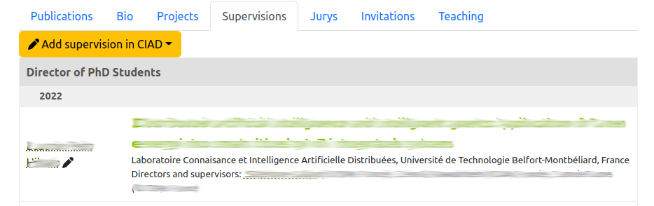
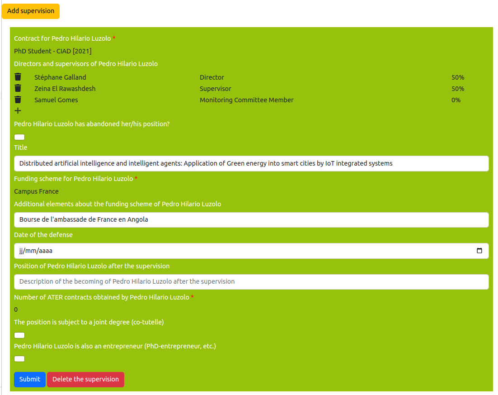

# Edit the supervisions of a person

> **_3 steps_**

## Step 1. Open the editor

For editing your supervisions, open your page on the website. If you are connected and you have included the supervisions on the page (see [editing of the member page](editmemberpage.md)), editing tools are provided as illustrated on the figure below: `Add supervision in CIAD` for adding a supervision, and the "pen" icon on the side of an existing supervision.

## Step 2. Edit an existing supervision

The editor of the supervisions is a special page that shows all the supervisions for a person.

Each supervision for a person X is displayed is a separated box that is green for existing supervision in the information system, and magenta for a new supervision.

This box contains a fields that are describing the supervision as follow:

* `Contract for X`: The [organization membership](editorgamemberships.md) of the person X that is concerned by the supervision could be selected in a drop-down box. This drop-down box contains all the organization memberships of "supervisable" type.
* `Directors and supervisors of X`: it is a list of persons who have supervised the person X. For adding a person, you could click on the "+" symbol. For deleting a person, you could click on the "trash" icon. You could enter the following informations for each supervising person:
  1. The name of the supervisor
  2. The type of supervision: Director, Supervisor, Member of the monitoring committee
  3. The percentage of supervision in the group of supervisors
* `X has abandonned her/his position?`: it is a checkbox that indicates person X has abandonned the supervized position.
* `Title`: it is the title of the work to be done during the supervision, e.g. the title of a PhD thesis.
* `Funding scheme for X`: indicates the scheme that is used for paying the person X.
* `Additional elements about the funding scheme of X`: is a free text area in which you could provide details about the funding scheme of the person X.
* `Date of the defense`: indicates the date at which the supervision is finished or the final defense is done.
* `Position of X after the supervision`: enables you to indicate the profesionnal position of the person X after the supervision period is finished. It describes the becoming of the person X.
* `Number of ATER contracts obtained by X`: indicates how many times the person X has signed an ATER contract with her/his employer in the context of the supervision.
* `The position is subject to a joint degree (co-tutelle)`: indicates if the position enables the person X to obtain a double degree.
* `X is also an entrepreneur (PhD-entrepreneur, etc.)`: indicates that the person X is also a CEO or entrepreneur in parallel to this supervision.

Click on the `Submit` button for saving your changes.

## Step 3. Adding a missed supervision

If a supervision is missed, click on the button `Add supervision in X`:

**You have to select the name of the person who is supervized.** If the name of the supervized person does not appear, contact the application manager for fixing her/his position in the organization.

In the addition page, you have to click on the button `Add supervision` and fill up the form according to the guidelines that are described in Step 2. 

