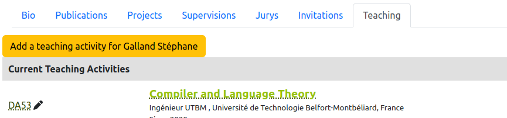
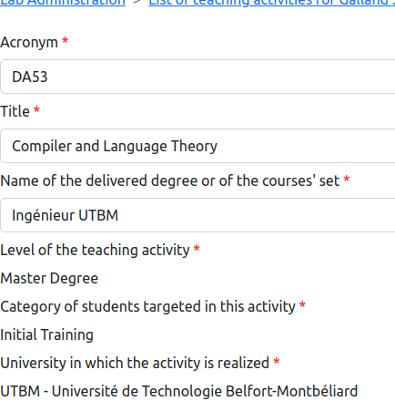

# Edit the teaching activities

> **_3 steps_**

## Step 1. Open the editor

For editing your invitations, open your page on the website. If you are connected and you have included the teaching invitations on the page (see [editing of the member page](editmemberpage.md)), editing tools are provided as illustrated on the figure below: `Change teaching activities` for updating the list of your your activities, and the "pen" icon on the side of an activity for editing it.

## Step 2. Edit an existing teaching activity

The editor of a teaching activity is a special page that shows all the fields of the activity for a person.

Each invitation for a person X is displayed is a separated box that is green for existing invitations in the information system, and magenta for a new invitation.

This box contains a fields that are describing the invitations as follow:

* `Acronym`: the acronym or the short name of the activity.
* `Title`: the full title of the activity.
* `Name of the delivered degree or of the courses' set`: the name of the degree in which the activity is involved.
* `Level of the teaching activity`: the level of the activity in high school, bachelor, master or doctoral level.
* `Category of students targeted in this activity`: category of student in initial education, education with apprenticeship or dual education, continuing education.
* `University in which the activity is realized`: the university or faculty in which the activity is realized.
* `Language`: the language used during the teaching activity.
* `Start date`: the date of starting.
* `End date`: the date of ending, if any.
* `Role of the person in this activity`: the role of the person in the activity. It may be the creator and supervisor of the activity, the supervisor of the actibity or a participant to the activity.
* `Has the person different hETD factors for tutorials and practice works?`: In many universities, hETD represents the equivalent number of hours of tutorial works that corresponds to the types of tasks in the teaching activity. To compute the hETD amount, the number of hours for a given type of task is multiplied by a factor, e.g. `1.5` for lecturing sessions. In some universities, the factors for tutorials and practice work sessions are same, and in other universities, these factors are different. This checkbox allows to indicate if there is a difference in the factors or not. Factors are hard coded in the software.
* `Annual number of hours per activity type`: indicates the number of hours per type of task that is realized per year. This number of hours is the real number of hours and not hETD.
* `Estimated number of students per year`: this field contains an estimation of the number of students that are participating to this activity every year.
* `Some text that is explaining the activity, its supervision or any key element`: It is a text that explain the activity and that may be included in generated documents by the information system.
* `URL of an Internet page that is dedicated to this activity`: Internet address of the main page that is dedicated to the teaching activity.
* `URL for accessing to the source code associated to this activity`: Internet address of the source code that is dedicated to the teaching activity.
* `Slides of the activity`: PDF file that contains the slides or the presentation of the teaching activity.

Click on the `Submit` button for saving your changes.

## Step 3. Adding a missed teaching invitation

If a teaching activity is missed, click on the button `Add teaching activity for X`, where `X` is the name of the person:

In the addition page, you have to fill up the form according to the guidelines that are described in Step 2. 

