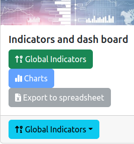
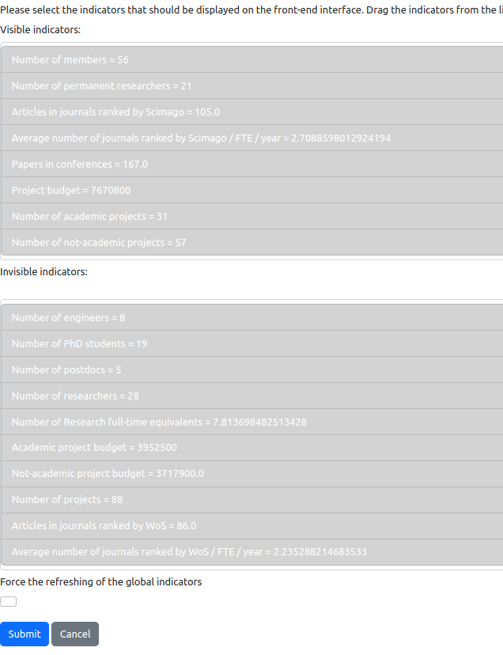
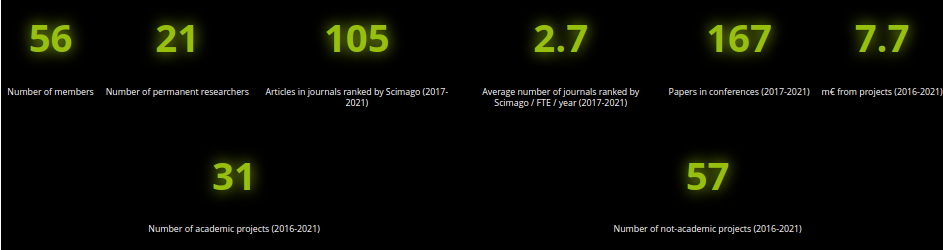

# Global Indicators

## 1. Introduction

The information system of the lab contains tools for managing global indicators. Global indicators are key values that represent the activities of the research organization, e.g., number of publications, number of members, etc.

The management of gloal indicators is accessible from the general administration page:

As it is illustrated on the figure above, a feature is provided for administration:

* `Global indicators` (green box): enables to configure the global indicators (see Section 2).

Front-end feature is:

* `Global indicators` (blue box): shows the global indicators from the front-end point-of-view.

## 2. Configure the global indicators

The configuration tool is based on two lists as illustrated by the following figure:

You have the choice to make a global indicator visible or not on the front-end interface. In order to make the choice, you have to understand that an indicator is shown as a cell in one of the lists. The first list on the top contains the visible indicators, the second list on the bottom contains the invisible indicators. You have simply to drag&drop the indicator from one list to the other. The order of the indicators in the first list will be the order of the indicators shown on the front-page, as illustrated by the figure below:

The checkbox with the name `Force the refreshing of the global indicators` enables you to reset the values of the indicators and to force the computation of these values.

