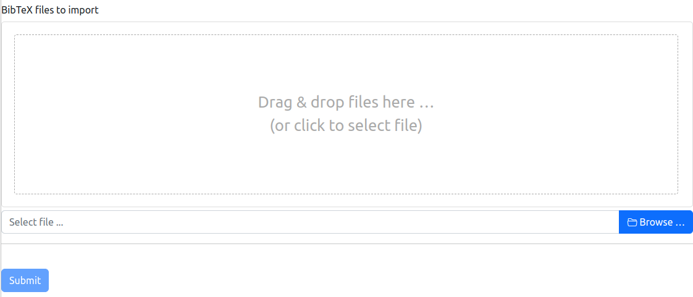
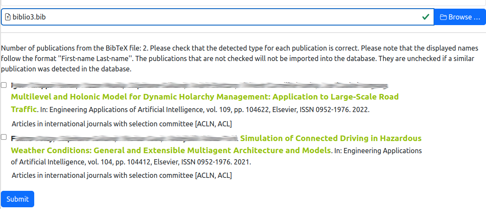

# Import publications from a BibTeX file

> **_4 steps_**

## Step 1. Select the BibTeX file

The BibTeX importer is a specific page that looks like the following figure. You have to select the BibTeX file to import.

> **_Important Note:_** Be sure that all the journals that are mentionned in the BibTeX file were already added in the informaion system. If a journal is missed, you have to [add it by hand](journals.md).

## Step 2. Obtaining the content of the BibTeX file

After selecting a BibTeX file, it is sent to the server which is loading the data from the file and comparing it to the content of the information system.

The result of this analysis is displayed back on the page:

## Step 3. Validating or changing the types of the publications

For each publication read from the BibTeX, the server tries to infer the type of publication. The inferred type is displayed after the details of the publication.
For example, on the previous figure, the publication with the title "Multilevel and Holonic Model for Dynamic Holarchy Management: Application to Large-Scale Road Traffic" is detected as `Articles in international journals with selection committee [ACLN, ACL]`.

If you not agree this type, you could change it by selected the correct type in the combo box.

## Step 4. Choosing the publications to be imported

For each entry read from the BibTeX file, a checkbox is provided.

If this box is checked, the server considers that the publication is new and should be imported.

If the checkbox is not checked, the publication is considered as a duplicate and should not be imported in the information system.

Change the checkbox for indicating the publications to be imported.

When you have validated all the publications from the BibTeX file, you could click on the `Submit` button for sending the data to the server and update the information system.

