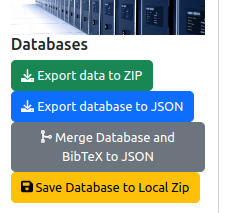
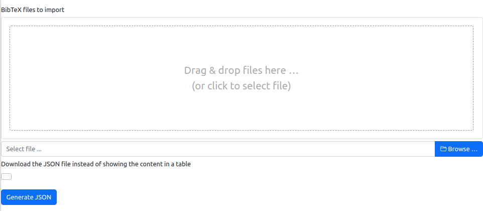
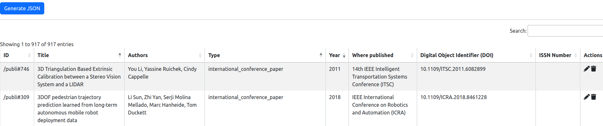

# Import to and export from the database

## 1. Introduction

The information system is based on a database. It is possible to import and export data using files with JSON format. The tools for importing and exporting are accessible on the administration page:

As it is illustrated on the figure above, four features are provided:

* `Export data to ZIP`: Build a ZIP file that is containing the content of the database in JSON format and all the associated files (PDF files for publications, background images for addresses, etc.).
* `Export database to JSON`: Build a JSON file that describes the content of the database.
* `Save Database to Local Zip`: It is the same as the first feature, except that instead of downloading the ZIP file, this file is written in the file system of the server.
* `Merge Database and BibTeX to JSON`: provides a tool for merging the content of the database and the content of a BibTeX file, and automatically detecting duplicated or conflicting publications (see Section 2 for details).

For importing data to the database, move to Section 3.

## 2. Merge Database and BibTeX to JSON

Sometimes, it is interesting to validate the content of a BibTeX file without importing it directly in the database. This tool is built for getting publications from the database and from a provided BibTeX file, and then to detect conflicting and duplicate publications.

The steps are the following:

1. Select a BibTeX file in the provided browser:

2. Indicate if you prefer to download the JSON that is the result of the merging, or display the analysis on the page.
3. Click on the button `Generate JSON` and wait for the termination of the task.

If you have decided to display the result of the analysis, the following table is displayed:

Each line of the table shows a publication. If the publication is in red, it has a conflict with another publication or it is a duplicate. If the publication is in orange, the publication could be considered for update and merging.

Then, you could edit the publication or deleting it with one of the two actions that are available in the last column. 

## 3. Importing data into the database

There is no web interface for importing data into the database in order to avoid any "bad" import.

For importing data, you have to copy the ZIP file or the JSON file (see Section 2) into the data application folder on the server. The name of the file must be `data.zip` or `data.json`. Then, you have to restart the application on the server because the importing process is run at the startup of the application.

