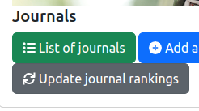
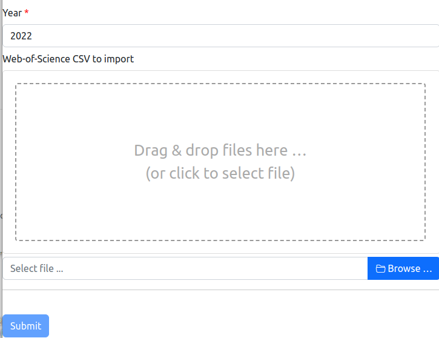
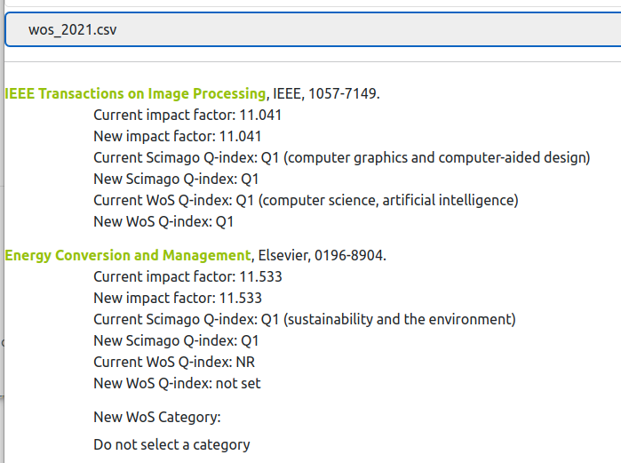

# Update the Rankings of the Journals

## 1. Introduction

Knowing the scientific journals is important for characterising the research activities of the laboratory.
The information system of the lab contains a list of known journals that may be refered from the rest of the information system elements, and that contains all the needed informations for a journal, includings there **Scimago and Web-ofScience (WoS) rankings**.

Every year, it is possible to update the journal rankings from information provided by Scimago and WoS. To do so, a tool is provided for obtaining these informations and change the content of the database.

As it is illustrated on the figure above, two features are provided:

* `Update journal rankings`: launch the tool for updating the annual journal rankings.

This feature is described in the following section.

## 2. Update Journal Rankings

The process for updating the journal ranking is based on three major steps that are described below.
But, before giving details on them, some elements are provided in the background section below.

### 2.1 Background

The journal rankings are based on the following informations and sources:

* Q-index from [Scimago](https://www.scimagojr.com)
* Q-index from [WoS](https://www.webofscience.com)
* Impact factor from [WoS](https://www.webofscience.com)

The laboratory's information system will directly download the information from Scimago. **So that you need to be connected to Internet for uing the journal ranking updater.**

Information from WoS cannot be downloaded directly. You must provide a CSV file that contains the following informations (or columns). This file could be generated from WoS if you are a registered user on this platform.

List of the mandatory columns in the WoS CSV are:

* `ISSN` is the ISSN number of the journal;
* `EISSN` is the electronic ISSN number of the journal;
* `Category & Journal Quartiles` is the column that contains the list of the scientific categories for the journal and the associated quartile. The format of this information is based on a list of items separated by `;`. Each item follows the format `category name - base (quartile)`;
* `IF` is the impact factor of the journal.

### 2.2 Step 1: Select information sources

The first step of the updating process is dedicated to the selection of the information sources. The form is illustrated by the following figure.

Two informations must be provided by you:

* **Reference year**: the year for which the information are relevant to.
* **Web-Of-Science CSV to import**: the CSV file that contains the information provided by WoS for the reference year.

As soon as you have selected the CSV file, the form starts automatically the analysis of the information sources, and moves to Step 2.

## 2.3. Step 2: Selecting missed scientific categories

After the analysis of the informaiton sources, the form is updated with a summary of the information for each journal. The form may also contain dropboxes for selected the scientific categories that are missed for obtaining the right Q-index.
The figure below shows an example of the information that are displayed in the form.

For each journal, after providing the journal's information, the known and new Q-indexes and impact factors are mentionned.

For several journals, the information system does not known the scientific category for which the Q-index must be retrieved. In this case, the form contains a drop box in which you could select the right scientific category for Scimago or WoS, or the fact that this source does not rank the journal.
This drop box is illustrated at the bottom of the figure above, with the label `New WoS Category` and the selected value `Do not set a category`, which means that you would not change the category in the database.

After going through all the journals on the form, and possibly provided new scientific categories, you could move to Step 3.

## 2.4. Step 3: Validation

After reviewing the information for all the journals that are mentionned in the form, you could save the changes in the database.
This action will saves the Q-indexes and impact factors for the reference year, as well as the selected scientific categories.

For saving the information in the database, you have to push the `Submit` button, at the bottom part of the form.

