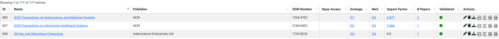
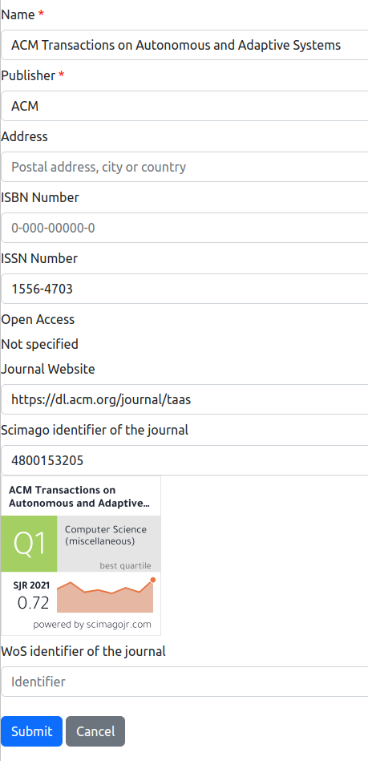
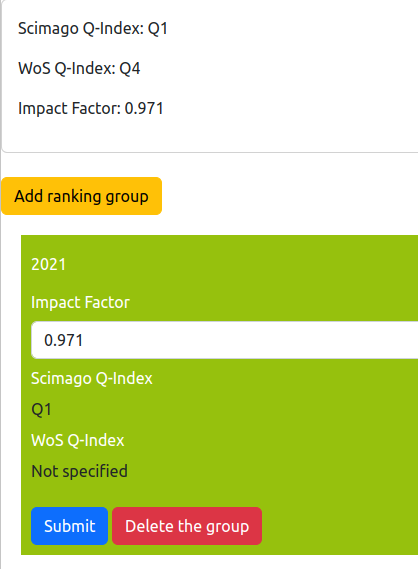

# List of known journals

## 1. Introduction

Knowing the scientific journals is important for characterising the research activities of the laboratory.
The information system of the lab contains a list of known journals that may be refered from the rest of the information system elements, and that contains all the needed informations for a journal.

The management of the journals' list is accessible from the general administration page:

As it is illustrated on the figure above, two features are provided:

* `List of journals`: display the list of all the journals and the associated tools for updating them.
* `Add a journal`: add a journal that is not yet inside the information system.

There two features are described in the following sections.

## 2. List of journals

The entire list of the journals is displayed in a table:

The columns of the table are the following:

* `ID`: the identifier of the journal inside the lab's information system.
* `Name`: the name of the journal and the link to the offical website of the journal if it is known.
* `Publisher`: the name of the institution which is publishing the journal.
* `ISSN number`: the International Standard Serial Number (ISSN) which is identifying the journal worldwide.
* `Open access`: indicates if the journal is open access (cell content is `yes`), not open access (cell content is `no`), or access type is unknown (empty cell).
* `Scimago`: indicates quartile of the journal on Scimago website (see Section 4 for updating this ranking).
* `WoS`: indicates quartile of the journal on Web-of-Science website (see Section 4 for updating this ranking).
* `Impact Factor`: indicates impact factor of the journal, usually provided by the publisher (see Section 4 for updating this impact factor).
* `# Papers`: the count of papers that were published in this journal by a member of the research organization.
* `Actions`: list of tools to be applied on a journal:
  * editing the journal information (see Section 3),
  * deletion of the journal,
  * updating of the journal ranking (see Section 4),
  * exporting the published papers in different formats (BibTeX, Word/ODT, HTML),
  * exporting the journal description in JSON format.

## 3. Adding or editing a journal

The backend software provides a form for editing or adding a journal in the information system. This form contains the mandatory informations (marked with a red star) and the optional informations to be associated to a journal:

* `Name`: it is the complete name of the journal.
* `Publisher`: it is the name of the institution which is publishing the journal.
* `Address`: it is the geographical location of the publisher. Usually, you have to mention the country, and sometimes the city.
* `ISBN Number`: it is the International Standard Book Number (ISBN) of the journal. Usually, a journal has not an ISBN number, but an ISSN number.
* `ISSN number`: the International Standard Serial Number (ISSN) which is identifying the journal worldwide.
* `Open Access`: indicates if the journal is open access or not.
* `Journal Website`: it is the URL of the official website of the journal
* `Scimago identifier of the journal`: it is the unique number associated to the journal of the [Scimago](http://www.scimagojr.com) system. When an identifier is entered for the journal, the form display the image that is provided by the Scimago website and containing the quartile and SJR indicators.

> **_IMPORTANT NOTE 1:_** Without a Scimago identifier, the information system of the laboratory will not get the quartiles from the Scimago website. You will have to enter them manually (see Section 4).

* `WoS identifier of the journal`: it is the unique number associated to the journal of the [Web-of-Science](http://www.webofscience.com) system.

> **_IMPORTANT NOTE 2:_** Without a WoS identifier, the information system of the laboratory will not get the quartiles from the Scimago website. You will have to enter them manually (see Section 4).

## 4. Ranking of a journal

Ranking of the journals is based on three indicators for each year:

* Quartile from [Scimago](http://www.scimagojr.com).
* Quartile from [Web-of-Science](http://www.webofscience.com).
* Impact factor of the journal provied by the publisher.

Consequently, the ranking of a journal paper is composed by the values of these three indicators for the year of publication of the concerned paper.

The information system contains the ranking values per year for each journal. A form is proposed for editing these values:

The journal ranking database is a sequence of quadruples `<Y, S, W, I>`, where `Y` is the year, `S` is the Scimago quartile, `W` is the WoS quartile and `I` is the journal impact factor. The quadruples in the sequence are sorted from the more recent (highest `Y`) to the less recent (lowest `Y`).

The current values of an indicator for a journal corresponds to the first value found in the quadruple sequence that is providing the value. Consequently, the input form enables you to enter the quadruple with possibly empty indicators. The current values of the indicators are displayed at the top of the input form.

