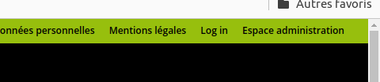
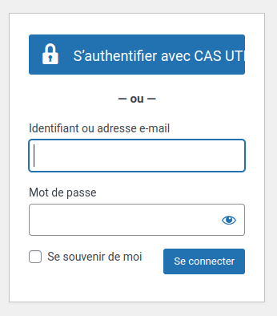
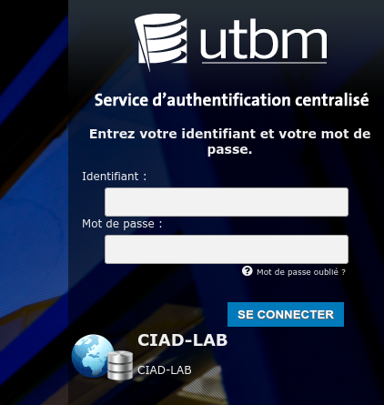
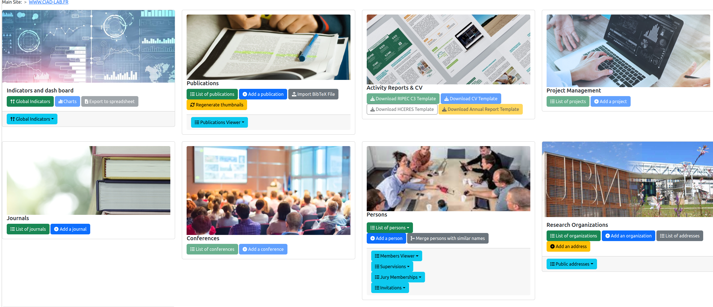

# Connection to the CIAD web backend

For changing the information on the CIAD website, you must be connected using one of the supported accounts.
Therefore, it is mandatory to connect yourself following the steps below.

## Step 1. Opening the connection box

* Click on `Log in` at the top-right corner of the CIAD website page.

* The following box should appear. It is the connection box that must be use to let you entering in the system.

* **Two types of accounts are supported:**
  1. UTBM account for persons who are hosted at UTBM (you have an email at UTBM with the appropriate login and password). Move to Step 2.
  2. CIAD account for persons who are hosted at uB or in another institution (you have an email at uB or another institution with the appropriate login and password). Move to Step 3.

## Step 2. Connection with an UTBM account

* Click on `S'authentifier avec CS UTBM` if you have an UTBM account, i.e. a login and a password for accessing to your email box `@utbm.fr`.
* The UTBM connection box should appear:

* Enter your UTBM login (the one that you are using for accessing your email box).
* Enter your UTBM password (the one that you are using for accessing your email box).
* Click on `Se connecter`
* If the entered informations enable to connect yourself, move to Step 4.
* If you cannot be connected, move to Step 5.

## Step 3. Connection with an CIAD account

* If you have not an UTBM account, i.e. the CIAD manager has created an account for you on the CIAD website, use the two input components in the form below:

* Enter your login (the one given to you by the CIAD manager).
* Enter your password.
* Click on `Se connecter`
* If the entered informations enable to connect yourself, move to Step 4.
* If you cannot be connected, move to Step 5.

## Step 4. You are logged-in

When you are successfully connected to the backend software of CIAD, you should see the general administration page that is showing to you all the features of the software:

## Step 5. Impossible to be connected to the CIAD backend software

If you cannot be connected, most of the times, it is because:

* You have not entered the correct login or password. Double check them.
* You have not using the correct method for being connected. If your are member of UTBM, use the first method. Otherwise use the second method.
* Your access is not yet activated for the CIAD website (see below).

For activating your access, send an email to [laboratoire.ciad.direction@utbm.fr](mailto:laboratoire.ciad.direction@utbm.fr) with your hosting institution, your login ID. You will receive an email with the connection details after the CIAD direction has validated your access.

