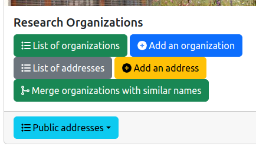
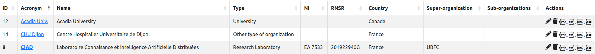
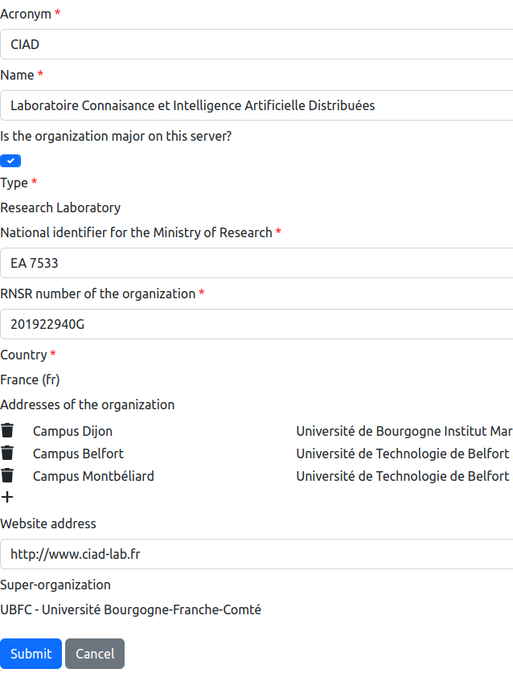
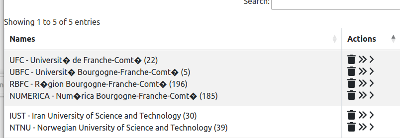
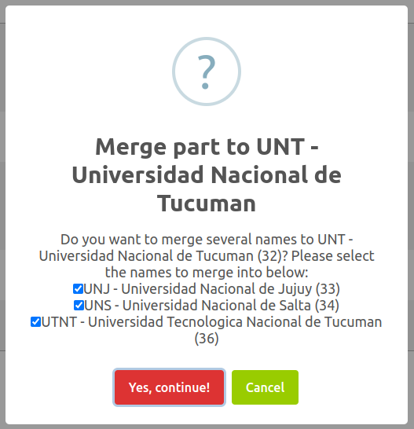

# List of research organizations

## 1. Introduction

The information system of the lab contains research organizations. The management of these organizations is accessible from the general administration page:

As it is illustrated on the figure above, two features are provided:

* `List of organizations`: display the list of all the research organizations.
* `Add an organization`: add a research organization in the information system.
* `Merge organizations with similar names`: detect the organizations which have similar names and propose to merge them (see Section 5).

## 2. Types of organizations

Research organizations may be of a specific type. The supported types are from the smallest entity to the largest entity:

* Research team
* Research department
* Research laboratory or institute
* Faculty
* University or college
* High school
* University community or network
* Other type of organization

As illustrated by the types above, the research organization may be hierarchiclly structured. In other words, an organization could be a part of another organization. Therefore, it is possible to define the super-organization that corresponds to the containing organization, and define the sub-organizations that are inside a specific organization.

## 3. List of organizations

The entire list of the reseach organizations is displayed in a table:

The columns of the table are the following:

* `ID`: the identifier of the organization inside the lab's information system.
* `Acronym`: the acronym of the orgnization, and a link to the official website of the organization if it is known.
* `Name`: the name of organization.
* `Type`: the type of organization (see Section 2).
* `NI`: the national identifier of the organization. This identifier is given by the national research ministry.
* `RNSR`: the identifier of the organization in the French "Registre National des Structures de Recherche".
* `Country`: the country of the research organization.
* `Super-organization`: the name of the organization in which the current organization is located.
* `Sub-organizations`: the list of the names of the organizations that are inside the current organization.
* `Actions`: list of tools to be applied on an organization:
  * editing the organization information (see Section 4),
  * deletion of the organization,
  * exporting the published papers in different formats (BibTeX, Word/ODT, HTML),
  * exporting the organization description in JSON format.

## 4. Add or edit an organization

The backend software provides a form for editing or adding an organization in the information system. This form contains the mandatory informations (marked with a red star) and the optional informations to be associated to an organization:

* `Acronym`: the acronym of the orgnization, and a link to the official website of the organization if it is known.
* `Name`: the name of organization.
* `Is organization major on this server?`: Indicates if the organization is marked as a major organization on this server. A major organization is usually the organization that is concerned by the website. You should define maximum one major organization per server.
* `Type`: the type of organization (see Section 2).
* `National identifier for the Ministry of Research`: the national identifier of the organization. This identifier is given by the national research ministry.
* `RNSR number of the organization`: the identifier of the organization in the French "Registre National des Structures de Recherche".
* `Country`: the country of the research organization.
* `Addresses of the organization`: the list of addresses that are associated to the research organization. You could add an address by clicking on the `+` and removing an address by clicking on the trash symbol.
* `Website address`: the URL of the official website of the organization.
* `Super-organization`: the name of the organization in which the current organization is located.

## 5. Merge organizations with similar names

For some reasons, two organizations in the information system may corresponds to the same real organization. It may be caused by misspells in the names.

The platform provides a tool for merging the "similar" names into a single entry in the information system, without loosing information (projects, etc.). After analysing the database content, this tool shows the duplicate persons in a table:

In this table, the similar names are grouped (as illustrated on the figure above).
Then, you have the choice to ignore the group if you think they are not really duplicates.
Or, you could decide to fix the duplicate issue by choosing one of the following actions:

* **Deletion:** Delete a name by clicking on the "trash" icon.
* **Total merging:** Merge **all** the names into a single name that corresponds to the line on which you are clicking on the "double arrow" icon. In this case, all the informations associated to the names will be associated to the selected name after merging.
* **Partial merging:** Merge **some** names into a single name that corresponds to the line on which you are clicking on the "single arrow" icon. In this case, all the informations associated to the checked names (see the figure below) will be associated to the selected name after merging.

