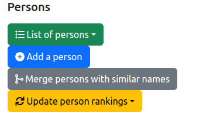
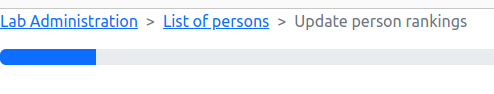
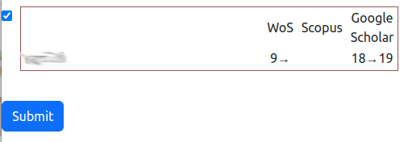

# Update the Rankings of the Persons

## 1. Introduction

The information system of the lab contains a list of the persons who are members, and that contains all the needed informations for a person, includings there **Web-ofScience (WoS), Scopus and Google Scholar (GS) rankings**, i.e., the h-index and number of citations.

Every year, it is possible to update the person rankings from information provided by the sources cited above. To do so, a tool is provided for obtaining these informations and change the content of the database.

As it is illustrated on the figure above, one feature is provided:

* `Update person rankings`: launch the tool for updating the annual person rankings.

This feature is described in the following section.

## 2. Update Person Rankings

The process for updating the person ranking is based on two major steps that are described below.
But, before giving details on them, some elements are provided in the background section below.

### 2.1 Background

The person rankings are based on the following informations and sources:

* H-index from [WoS](https://www.webofscience.com)
* The number of citations from [WoS](https://www.webofscience.com)
* H-index from [Scopus](https://www.scopus.com)
* The number of citations from [Scopus](https://www.scopus.com)
* H-index from [GS](https://scholar.google.com)
* The number of citations from [GS](https://scholar.google.com/)

The laboratory's information system will directly download the information from the above sources. **So that you need to be connected to Internet for using the person ranking updater.**

### 2.2 Step 1: Select information sources

After launching the tool, the system is downloading the person rankings from the different sources. You hae to wait for the downloading of the information as illustrated on the figure below.

**_Caution:_** Only the persons who have stricyl positive indicators (h-index or citations) will be considered as eligible for ranking updates. If an indicator is set to zero, the update process is skipped.

After all the information were downloaded, the page shows the list of person who are eligible to the updates and how the updates will be applied.

## 2.3. Step 2: Selecting the eligible persons to update

From the list of the eligible persons, you could select the ones for who the rankings will be saved in the information system.
This selection is done by checking the box on the side of a person name.

For saving the information in the database, you have to push the `Submit` button, at the bottom part of the form.

