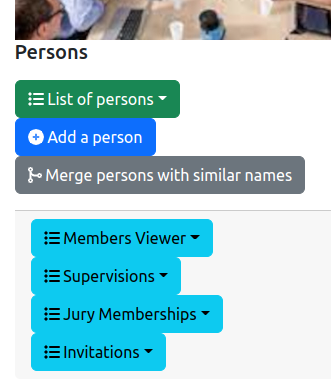
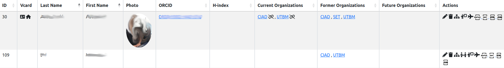
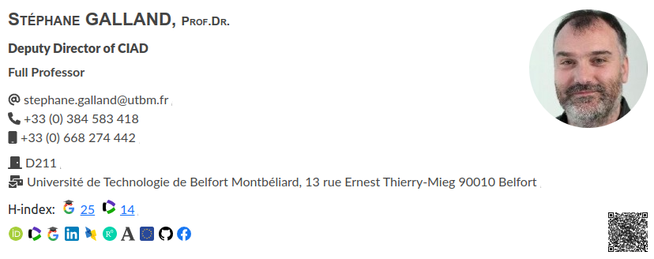
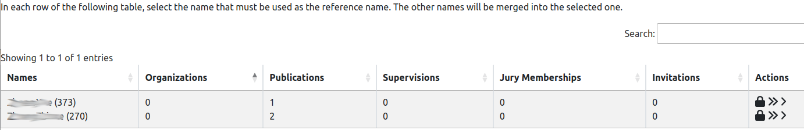
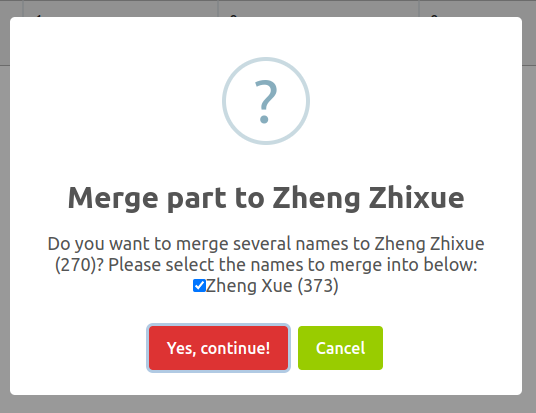

# List of persons and members

## 1. Introduction

The information system of the lab contains a list of persons that may be associated with other elements stored in the information system.

> **_Definition 1: Person_** is involved in one of the activities of the laboratory, e.g., a member of the lab, an author of a publication, etc. A person is described by several key properties that are detailled below.

> **_Definition 2: Member_** is a person that is a member of a [research organization](organizations.md) supported by the software.

The management of the list of persons is accessible from the general administration page:

As it is illustrated on the figure above, three features are provided for administration and four features related to the public front-end:

* `List of persons`: display the list of all the persons (see Section 2).
* `Add a person`: add a person in the information system (see Section 3).
* `Merge persons with similar names`: detect the persons who have similar names and propose to merge them (see Section 4).

Front-end features are:

* `Member viewer`: shows the list of members that could be displayed on the front-end.
* `Supervisions`: shows the list of supervisions that could be displayed on the front-end.
* `Jury memberships`: shows the list of the jury memberships that could be displayed on the front-end.
* `Invitations`: shows the list of incoming and outgoing invitations that could be displayed on the front-end.

## 2. List of persons

The entire list of the persons is displayed in a table:

The columns of the table are the following:

* `ID`: the identifier of the person inside the lab's information system.
* `Vcard`: provides two links. The first link (the card icon) shows the person card that may be displayed on the front-end, as illustrated by the following figure.

* `Last Name`: the last name of person.
* `First Name`: the last name of person.
* `Photo`: the picture of the person (see Section 3 for a description of the sources for the person picture).
* `ORCID`: the [ORCID identifier](https://orcid.org/) of the person, with the link to the ORCID page.
* `H-index`: the H-index of the person that is provided by [Scimago](https://scimagojr.com), [Web-of-Science](https://webofscience.com) or both.
* `Current organizations`: the list of the organizations in which the person has an active position.
* `Former organizations`: the list of the organizations in which the person had a position.
* `Future organizations`: the list of the organizations in which the person will have position.
* `Actions`: list of tools to be applied on a person:
  * editing the person information (see Section 3),
  * deletion of the person,
  * [editing the organization memberships](organizationmemberships) for the person,
  * [editing the jury memberships](jurymemberships) for the person,
  * [editing the incoming and outgoing invitations](invitations) for the person,
  * exporting the published papers for the person in different formats (BibTeX, Word/ODT, HTML),
  * exporting the person description in JSON format.

## 3. Add or edit a person

The backend software provides a form for editing or adding a person description in the information system. This form contains the mandatory informations (marked with a red star) and the optional informations to be associated to a person. The following figure shows you a part of the form.

* `Last Name`: the last name of the person.
* `First Name`: the last name of the person.
* `Gender`: the gender of the person.
* `Email`: the email of the person.
* `Office phone`: the office phone number of the person, using the international notation with the country prefix.
* `Mobile phone`: the mobile phone number of the person, using the international notation with the country prefix.
* `Office room`: the number of the office room of the person.
* `Gravatar identifier`: the identifier of the person on [Gravatar](http://gravatar.com). Gravatar is a online platform for stored and shared photo of a person. It is one of the sources for the information system to get the person's photo.
* `ORCID`: the identifier of the person on [ORCID](http://orcid.org), which is one of the standard platform for identifying a researcher worldwide.
* `Identifier on ResearchID, WoS or Publon`: the identifier of the person on [Web-of-Science](http://webofscience.com) (and the related ResearcherID and Publon platforms), which is one of the standard platform for identifying a researcher worldwide.
* `Identifier on Google Scholar`: the identifier of the person on [Google Scholar](https://scholar.google.com), which is one of the standard platform for obtaining stats on the person's scientific publications and the related indicators. It is also used for obtaining the photo of the person.
* `Identifier on Github`: the identifier of the person on [Github](https://github.com), which is one of the standard code sharing platform worldwide. It is also used for obtaining the photo of the person.
* `Identifier on Research Gate`: the identifier of the person on [Research Gate](https://researchgate.com), which is one of the pro social networks for researchers.
* `Identifier on Facebook`: the identifier of the person on Facebook.
* `Internet address of the DBLP page`: the URL of the person on [DBLP](https://dblp.uni-trier.de/), which is a platform for sharing your publications (mostly in Computer Science).
* `Internet address of the Academia.edu`: the URL of the person on [Academia](https://academia.edu/), which is a social network for sharing your publications.
* `Internet address of the EU CORDIS page`: the URL of the person on CORDIS, the web-site of the European Comission.
* `Naming convention for the person's page on the institution website`: it indicates how the URL of the person's page on the organization website is built. It may be:
  * `First and last names`: the URL is `https://hostname/fistname_lastname`.
  * `Email without domain part`: the URL is `https://hostname/someid` if the person has the email `someid@domain`.
  * `author-`: the URL is `https://hostname/author-<ID>` where the `<ID>` is replaced by the database ID of the person.
* `Hindex on Google Scholar`: the H-index of the person that is provided by [Google Scholar](https://scholar.google.com).
* `Hindex on Web-of-Science (WoS)`: the H-index of the person that is provided by [Web-of-Science](http://webofscience.com).

## 4. Merge persons with similar names

For some reasons, two persons in the information system may corresponds to the same physical person in Reality. It may be caused by misspells in the names, or the switching of the first name and the last name.

The platform provides a tool for merging the "similar" names into a single entry in the information system, without loosing information (publications, etc.). After analysing the database content, this tool shows the duplicate persons in a table:

In this table, the similar names are grouped (as illustrated on the figure above).
Then, you have the choice to ignore the group if you think they are not really duplicates.
Or, you could decide to fix the duplicate issue by choosing one of the following actions:

* **Deletion:** Delete a name by clicking on the "trash" icon. If a locker icon is appearing, it means that you are not allowed to delete the name.
* **Total merging:** Merge **all** the names into a single name that corresponds to the line on which you are clicking on the "double arrow" icon. In this case, all the informations associated to the names will be associated to the selected name after merging.
* **Partial merging:** Merge **some** names into a single name that corresponds to the line on which you are clicking on the "single arrow" icon. In this case, all the informations associated to the checked names (see the figure below) will be associated to the selected name after merging.

