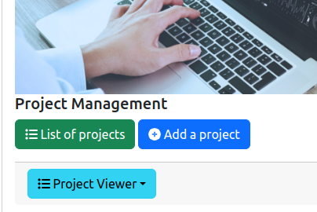
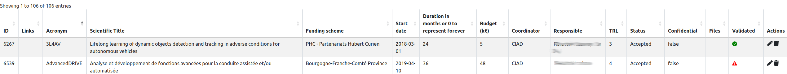
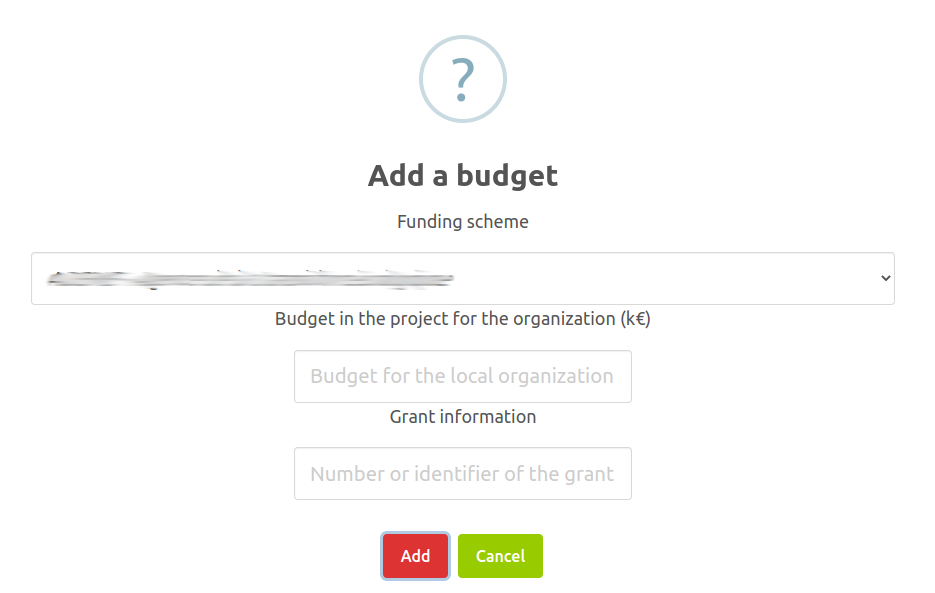
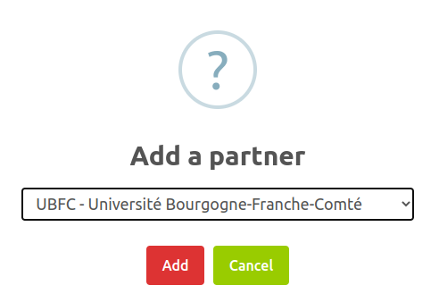
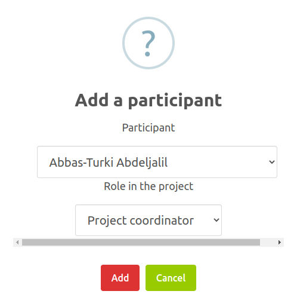
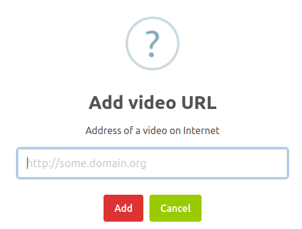

# List of known academic and non-academic projects

## 1. Introduction

Knowing the academic and non-academic projects is one of the important point for characterising the research activities of the laboratory.
The information system of the lab contains a list of known projects that may be refered from the rest of the information system elements, and that contains all the needed informations for a project.

Basically, the types of projects are:

* Academic project, or competitive-call project: a project that is based on competitive calls or with academic partners.
* Non-academic project, or industrial project: a project that is based on a query or a collaboration with an industrial partner.
* Open source project

The management of the project' list is accessible from the general administration page:

As it is illustrated on the figure above, two features are provided:

* `List of projects`: display the list of all the projects and the associated tools for updating them.
* `Add a project`: add a project that is not yet inside the information system.

There two features are described in the following sections.

The `Project Viewer` button allows you to see the result of the macro instructions that you could put in your research webpage, as documented [here](editmemberpage.md).

## 2. List of projects

The entire list of the projects is displayed in a table:

The columns of the table are the following:

* `ID`: the identifier of the project inside the lab's information system.
* `Links`: provides some links related to the project.
* `Acronym`: the acronym of the project.
* `Scientific Title`: the short scientific description of the project. **This title must be carrefully selected because it may be used by funding institutions, e.g., IC-ARTS, for determining if a project has a research contribution or not.**
* `Funding Scheme`: the list of the schemes that are used for funding the project. When it is known, the type of contract is also provided between parentheses.
* `Start date`: the date of start of the project, with the `YYYY-MM-DD` format.
* `Duration in months`: indicates the duration in months of the project. If the value `0` is provided as the duration of the project, the project is assumed to have no end and this column is empty.
* `Budget`: the budget of the project for the lab. It is not the global budget of the project for all the partners. Only the part of the budget dedicated to the lab is considered. The value is expressed in kilo-euros.
* `Coordinator`: the name of the organization (not the person) which is coordinating the project.
* `Responsible`: the names of the persons who are responsibles of the project in the lab.
* `TRL`: indicates the highest [Technology Readiness Level](https://fr.wikipedia.org/wiki/Technology_readiness_level) (TRL) that is reached by the project. This indicator is important for estimating the level of maturity of the project and used by many evaluation institutions (HCERES, IC-ARTS...).
* `Status`: indicates the current status of the project for the lab. The project may be "under prepration", "under evaluation", "accepted" (or funded), "rejected" or "canceled".
* `Confidential`: indicates if the project is marked as confidential. A confidential project is never displayed on the public pages. Only administration pages provide information on confidential projects.
* `Files`: provides a list of downloadable files related to the project.
* `Validated`: indicates if the information of the project is validated by an authority of the lab (Director for example).
* `Actions`: list of tools to be applied on a project:
  * editing the project information (see Section 3),
  * deletion of the project.

## 3. Adding or editing a project

### 3.1 General Form

The backend software provides a form for editing or adding a projects in the information system. This form contains the mandatory informations (marked with a red star) and the optional informations to be associated to a project:

* `Acronym`: it is the acronym of the project. Usually, it is a short word.
* `Scientific Title`: the short scientific description of the project. ****

> **_IMPORTANT NOTE 1:_** The scientific title must be carrefully written because it may be used by funding institutions, e.g., IC-ARTS, for determining if a project has a research contribution or not.

* `Start date`: it is the date of start of the project. This date is used as a reference in many official documents. Please provides the real start date that is mentionned in the project's consortium agreement or contract.
* `Duration in months`: indicates the duration in months of the project. If the value `0` is provided, the project is assumed to have no end.
* `Description`: it is the short description or summary of the project that will be displayed on the public pages related to the project.
* `Global budget`: it is the global budget of the project, including all the partners. It must be expressed in kilo-euros.
* `Budget(s) for the local organization`: it is the list of the budgets and their associated funding schemes that are provided to the lab for the project. You have to click on the `+` sign for adding a budget/funding scheme (see Section 3.2 for details).
* `Organization that is coordinating or funding the project`: the name of the organization that is coordinating the project.

> **_IMPORTANT NOTE 2:_** If the organization does not appear in the drop-down list, you have to add it manually as it is documented [here](organizations.md).

* `Name of the local organization involved in the project`: **It should be always the lab, i.e., CIAD.**

> **_IMPORTANT NOTE 3:_** If the organization does not appear in the drop-down list, you have to add it manually as it is documented [here](organizations.md).

* `Name of the super organization of the local organization`: **It should be always one of the universities in which the lab is located, i.e., UTBM or uB. It is the university in which the head of the responsible for the project in the lab is involved.**

> **_IMPORTANT NOTE 4:_** If the organization does not appear in the drop-down list, you have to add it manually as it is documented [here](organizations.md).

* `Name of the organization of the LEAR`: the name of the organization that is the **Legal Appointed Representative** (LEAR) for the project.

> **_IMPORTANT NOTE 5:_** If the organization does not appear in the drop-down list, you have to add it manually as it is documented [here](organizations.md).

* `List of partners that are not already specified`: specifies the list of the organizations that are involved in the project and not yet mentionned in the above fields. See Section 3.3 for details.
* `Participants from the local organization`: specifies the list of the persons in the local organization (specified above) that are involved in the project. See Section 3.4 for details.
* `Is the projet confidential?`: indicates if the project is marked as *CONFIDENTIAL*. A confidential project is never displayed on public pages.
* `Status of the project`: indicates the current status of the project for the lab. The project may be:
  * `Under prepration`: the project proposal is under writing or negociation. The project is not yeat submitted to the funding institution.
  * `Under evaluation`: the project was submitted to the funding institution and is under evaluation by this one.
  * `Accepted`: the project was accepted to be funded and have to proceed.
  * `Rejected`: the project was rejected by the funding institution.
  * `Canceled`: the project was canceled. Usually, this status is used when the project proposal cannot be written or submitted on time.
* `Type of contract or agreement for the project`: allows to specify the type of contract that is signed for the project. It is one of:
  * `RCO - Contract for collaborative contractual research, funded by public bodies`: for collaborative research that is funded by a public body, e.g., ANR, EU...
  * `RCD - Contract for direct contractual research, with shared IP`: a collaborative research with a not academic partner, in which the IP is shared with the partner.
  * `PR - Contract for contractual services, with transfer of IP`: a collaborative research with a not academic partner, in which the IP is transfered to the partner.
  * `PI - Contract dedicated to IP transfer`: a contract that is fully dedicated to the IP transfer to a not academic partner.
* `Open source`: indicates if the project is an open-source (if checked) project or not.
* `Type of activity for the project`: allows to specify the type of research activity that is carried out by the project. It is one of:
  * `Fundamental research`: the works done in the project are fundamental and theoritic.
  * `Applied research`: the works done in the project are related to the application of methods or models to an application domain.
  * `Experimental development`: the works done in the project are mostly based on software development with existing research outcomes.
* `Technology readiness level (TRL) of the project`: indicates the highest [Technology Readiness Level](https://fr.wikipedia.org/wiki/Technology_readiness_level) (TRL) that is reached by the project. This indicator is important for estimating the level of maturity of the project and used by many evaluation institutions (HCERES, IC-ARTS...).
* `List of the scientific axes to which the project is associated to`: indicates the scientific axes to which this project is associated to.
* `Document that describes the scientific requirements of the project`: you could upload a PDF document that corresponds to the "Scientific Requirements" or the "Scientific Proposal" of the project. **This document will be used by official institutions, e.g. IC-ARTS, for validating the scientific contribution of the project.**
* `Logo of he project`: you could upload a picture (JPEG, PNG) that represents the logo of the project.
* `URL of the website of the project`: is the URL of the official website of the project. This website is not the one that is on the lab's webiste. For the web page of the project on the lab's website, see the field below.
* `Naming convention for the project's page on the institution website`: when the project has a public page on the lab's website, the URL of this page is built up according to one of the following standard, that could be selected in this field:
  * `Not specified`: the project has no public page on the lab's website.
  * `project-`: the URL of the page is `https://www.ciad-lab.fr/project-<ID>`, where `<ID>` is the identifier of the project in the lab's information system.
  * `Acronym of the project`: the URL of the page is `https://www.ciad-lab.fr/<ACRONYM>`, where `<ACRONYM>` is the acronym of the project in the lab's information system (see above).
* `Images associated to the project`: you could upload a list of images that are associated to the project. These images are usually used for building slides or on the public page of the project on the lab's website.
* `Links of the videos associated to the project`: specifies the list of URL to external video. See Section 3.5 for details.
* `Short PowerPoint presentation for the project`: you could upload a Power Point document that describes the project. This presentation is usually used by the Director of the lab for explaining your project to any interested person.
* `Press document related to the project`: you could upload a PDF document that is published by a Press company. It is usually a vulgarization/popularization/simplification document that mentions or describes the project. 
* `Is the project validated by a local authority?`: this check box indicates if the Director of the lab has validated the information of the project.

### 3.2 Adding budget and funding scheme for the local organization

A project could be funded by several institutions. It is possible to specify the different sources of funds in the list of the budget/funding scheme in the general editing form that is described above.

Each time you would add a budget/funding scheme, the following dialog box is shown on the screen:

On this dialog box, you must enter the following information related to a funding source:

* Funding scheme: the institution or the type of fund source that is providing the budget to the project.
* Budget for the local organization: the budget of the project for the lab by the funding scheme above. It is not the global budget of the project for all the partners. Only the part of the budget dedicated to the lab is considered. The value is expressed in kilo-euros.
* Grant information: you may provides the grant agreement or contract's number here.

After clicking on the `Add` button, the funding scheme, budget and grant number are added to the project.

### 3.3 Adding partner organization in the project

Multiple organizations may be involved in a project. If an organization is involved and not yet mentionned in the general input form, it is possible to add the organization in the members of the project's consortium. The following dialog box allows you to enter a new partner:

On this dialog box, you must select the partner in the drop-down list. After clicking on the `Add` button, the organization is added as partner in the project.

> **_IMPORTANT NOTE 6:_** If the organization does not appear in the drop-down list, you have to add it manually as it is documented [here](organizations.md).

### 3.4 Adding a participant in the project

A participant is a person who is member of the lab and who is involved in the project. Each person has a specific role in the project. So that, adding a participant means that you have to specify the person and her/his role in the project, as illustrated on the figure below.

> **_IMPORTANT NOTE 7:_** If the person does not appear in the drop-down list, you have to contact the Director of the lab for adding this person in the information system.

The available roles for a person are:

* Project coordinator: the person is in charge of the coordination and management project as a whole, and has the charge of interacting with the funding institution(s).
* Scientific head: the person is the head of one of the partners in the consortium, but he/she is not the general coordinator of the project.
* Work package leader: the person is leading a work package of the project.
* Task leader: the person is leading a task in the project.
* Participant: the person is participating to the project.

### 3.5 Adding a video URL for the project

It is always a good point that a project is associated to online videos. So that, it is possible to specify the URL of the videos that could be found, seen or download from Interet.
A specific dialog box allows to enter the URL of a video:

On this dialog box, you must enter a valid URL. Usually, the public URL provided by Youtube is correct. CIAD lab has a specific [Youtube channel](https://www.youtube.com/@MultiagentGroup) on which you could upload your videos (please contact CIAD Director for details).

