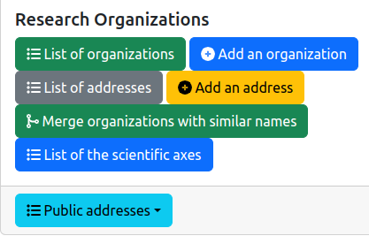
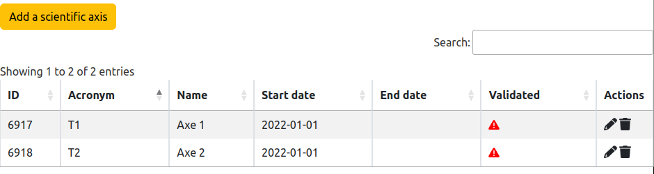
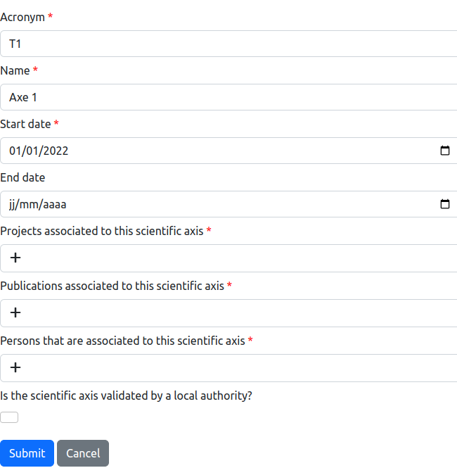

# List of scientific axes

## 1. Introduction

The information system of the lab contains scientific axes. The scientific axes do not correspond to the structure of a research organization. However, they participate to the organization of a research team. A scientific axis describes a research topics in a research organization. The management of these axes is accessible from the general administration page:

As it is illustrated on the figure above, the following feature is provided:

* `List of the scientific axes`: display the list of all the scientific axes.

## 2. List of scientific axes

The entire list of the scientific axes is displayed in a table:

The columns of the table are the following:

* `ID`: the identifier of the axis inside the lab's information system.
* `Acronym`: the acronym of the axis.
* `Name`: the name of axis.
* `Start Date`: the date at which the scientific axis starts to be active.
* `End Date`: the date at which the scientific axis finishs to be active.
* `Validated`: indicates if the scientific axis was validated by an authority in the research lab.
* `Actions`: list of tools to be applied on an axis:
  * editing the axis information (see Section 3),
  * deletion of the axis.

## 3. Add or edit an axis

The backend software provides a form for editing or adding a scientific axis in the information system. This form contains the mandatory informations (marked with a red star) and the optional informations to be associated to an organization:

* `Acronym`: the acronym of the scientific axis.
* `Name`: the name of axis.
* `Start Date`: the date at which the scientific axis starts to be active.
* `End Date`: the date at which the scientific axis finishs to be active.
* `Projects associated to this scientific axis`: the list of projects which are related to this axis. This list could be edited, or the relationship between the axis and the project could be directly edited with the project edition form (see Section 4).
* `Publications associated to this scientific axis`: the list of publications which are related to this axis. This list could be edited, or the relationship between the axis and the publication could be directly edited with the publication edition form (see Section 4).
* `Persons associated to this scientific axis`: the list of persons (and more speciically memberships) which are related to this axis. This list could be edited, or the relationship between the axis and the membership could be directly edited with the membership edition form (see Section 4).
* `Is the scientific axis validated by a local authority?` indicates if a local authority, e.g. the Director of the research lab, has validated the information associated to the axis. 

## 4. Editing axis-entity relationships

Several entities may be associated to the associated axes: project, publication, person.
Instead of editing these relationships on the scientific axis's edition form, it is possible to change them on the entity's editing form:

* [Editing a project](./editprojects.md)
* [Editing a publication](./editpublications.md)
* [Editing a person membership](./editorgamemberships.md)

